# Installing Debian 12 on VxBuild

## Creating a Debian 12 USB Install Drive <a href="#create-debian-12-usb" id="create-debian-12-usb"></a>

To install Debian 12 on the build machine (VxBuild), you will need to download the latest Debian 12 amd64 installer file here: [Latest Debian Release](https://www.debian.org/releases/stable/debian-installer/).

You should use a blank USB drive for the install drive. The process described below will wipe any existing content.

To create a USB install drive with the downloaded ISO file:

1. Ensure that the USB drive is available to the system. By default, it tries to attach as the `/dev/sda` device. An easy way to verify this is via the following command:

```
lsblk /dev/disk/by-id/usb*part* --noheadings --output PATH
```

2. If the USB drive is not attached as the `/dev/sda` device, that’s ok. Simply replace `/dev/sda` with the device that your USB drive did attach to.

* NOTE: The command below should not include any number as part of the device path. For example, if the above command returns `/dev/sda1`, you must use `/dev/sda` as the path in the next command.

3. Now that you know the correct device path, you can create the USB install drive via the following command:

```
dd if=/path/to/debian-12.8.0-amd64-netinst.iso of=/dev/sda bs=4M && sync
```

* NOTE: At the time of this writing, the latest stable release is 12.8. Please update to the appropriate file name if you're using a newer version.

4. Once the above command completes, you can safely remove the USB install drive from your system.

## Installing Debian 12 on VxBuild <a href="#installing-to-vxbuild" id="installing-to-vxbuild"></a>

1. Before powering VxBuild on, insert the USB install drive created in the previous step.
2. After powering VxBuild on, begin pressing F12 until it enters the boot menu. Boot the system from the USB install drive.
3. You will be presented with the following screen. Select "Graphical install" and press enter.

<figure>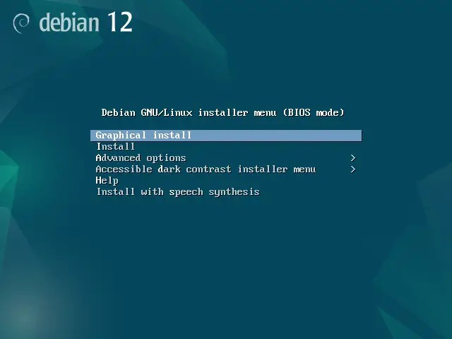<figcaption></figcaption></figure>

4. Select your preferred language and click "Continue".

<figure>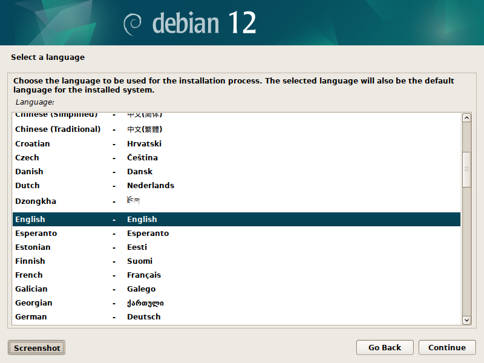<figcaption></figcaption></figure>

5. Select your location and click "Continue".

<figure>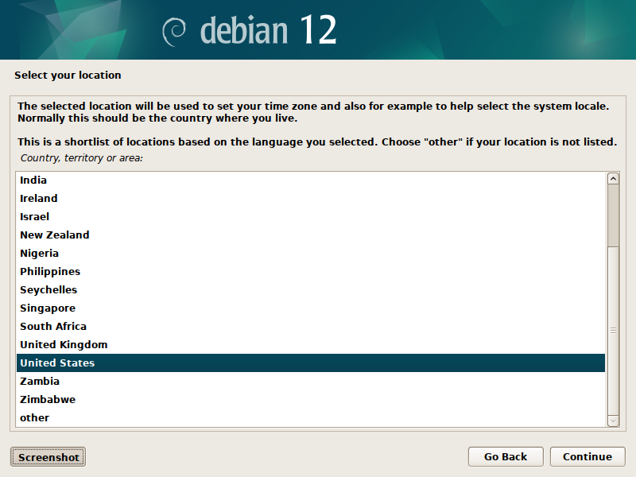<figcaption></figcaption></figure>

6. Select your keyboard layout and click "Continue".

<figure>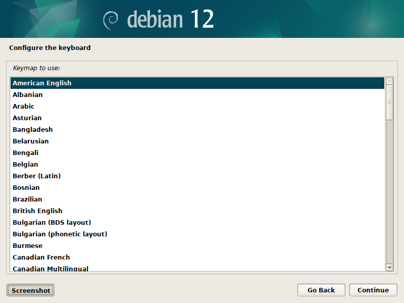<figcaption></figcaption></figure>

7. Select your network device (may differ from screenshot) and click "Continue".

<figure>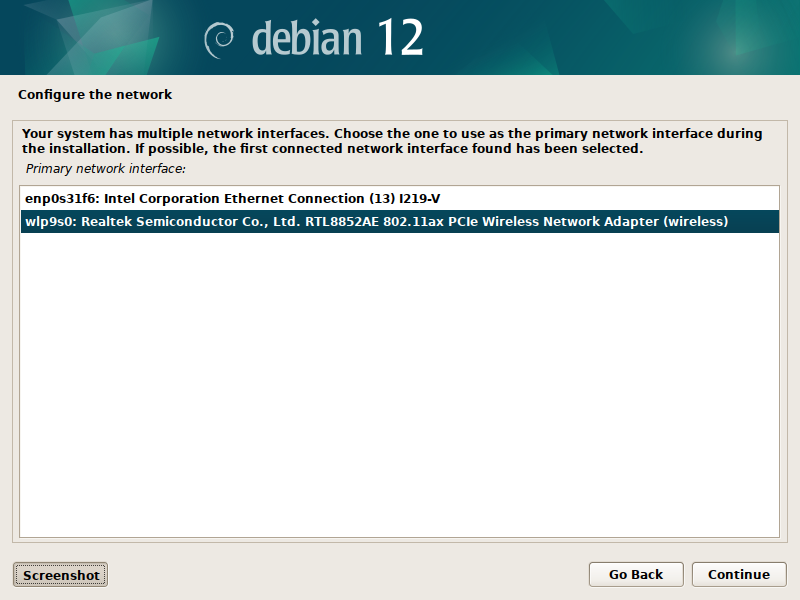<figcaption></figcaption></figure>

8. If using a wired connection, it will configure automatically.

<figure>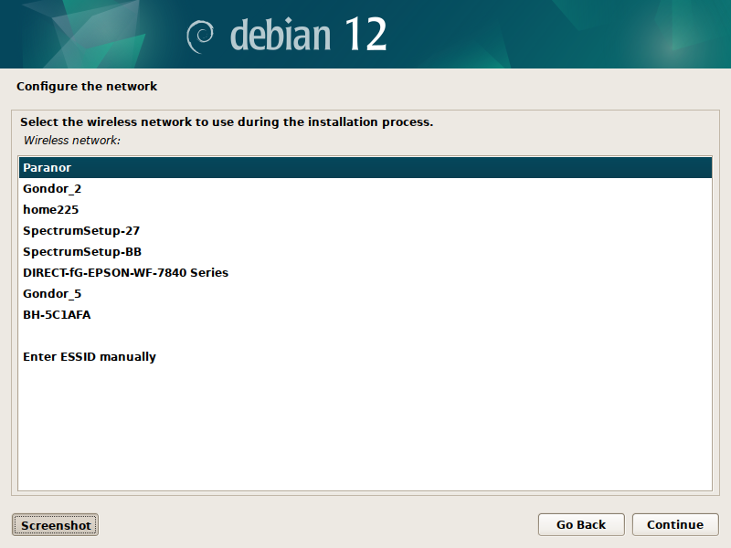<figcaption></figcaption></figure>

9. If using a wireless connection, select WPA/WPA2 PSK and click "Continue". Enter your wireless network password and click "Continue".

<figure>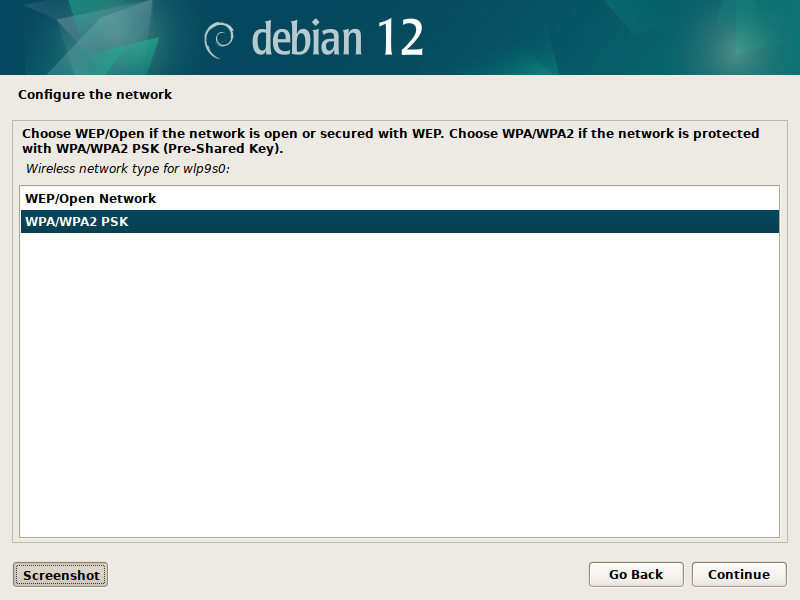<figcaption></figcaption></figure>

<figure>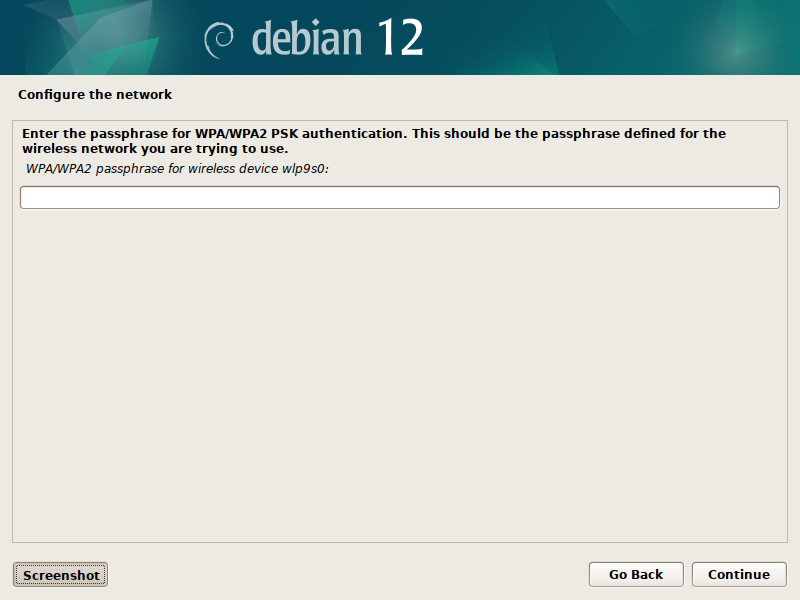<figcaption></figcaption></figure>

10. Enter "VxBuild" for the hostname and click "Continue".

<figure>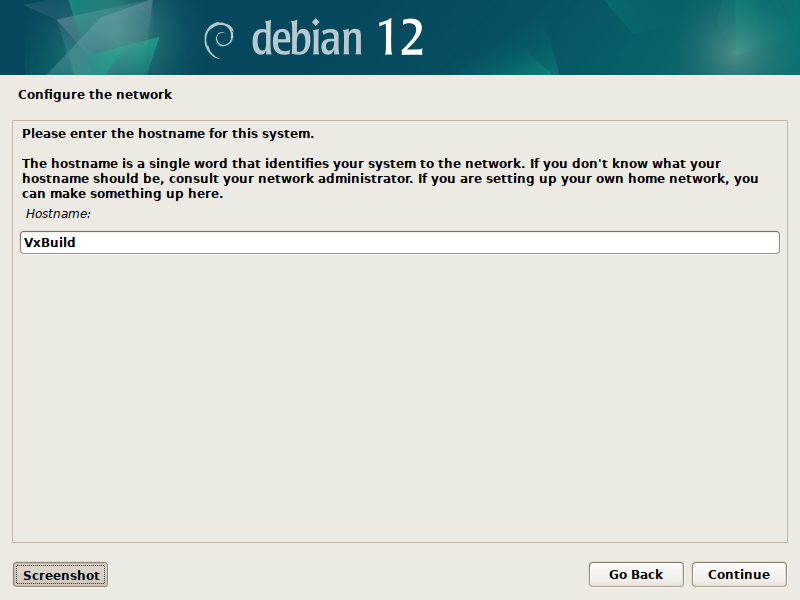<figcaption></figcaption></figure>

11. Leave the domain name blank and click "Continue".

<figure>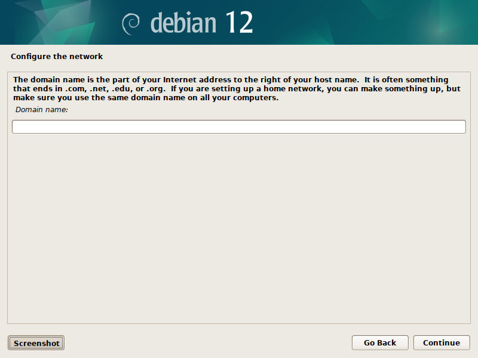<figcaption></figcaption></figure>

12. Set the root user password and click "Continue".

<figure>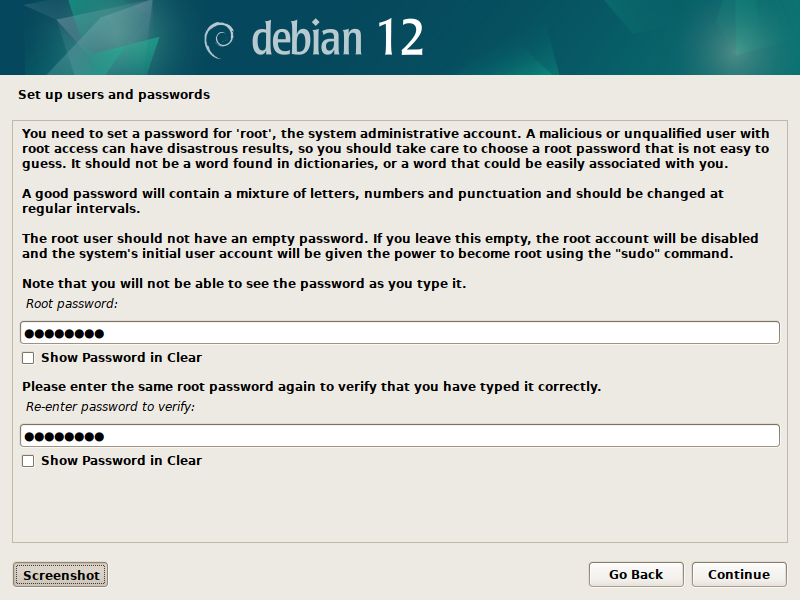<figcaption></figcaption></figure>

13. Enter "Vx" for the full name for the new user and click "Continue".

<figure><figcaption></figcaption></figure>

14. Enter "vx" as the username and click "Continue".

<figure>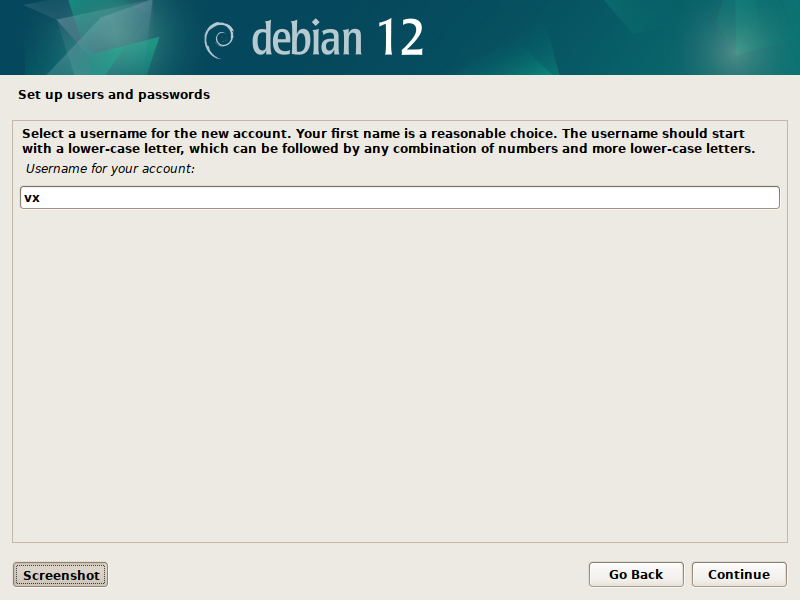<figcaption></figcaption></figure>

15. Enter a password for the "vx" user and click Continue.

<figure>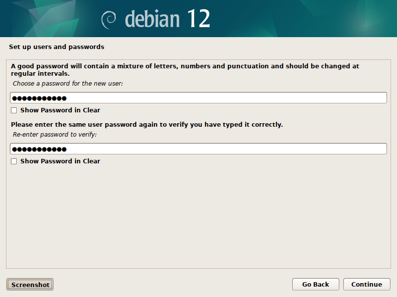<figcaption></figcaption></figure>

16. Select your timezone and click "Continue".

<figure>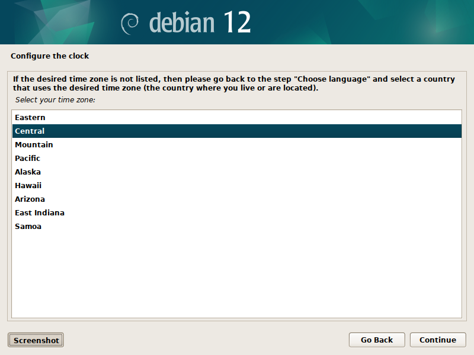<figcaption></figcaption></figure>

17. Select "Guided - use entire disk" and click "Continue".

<figure>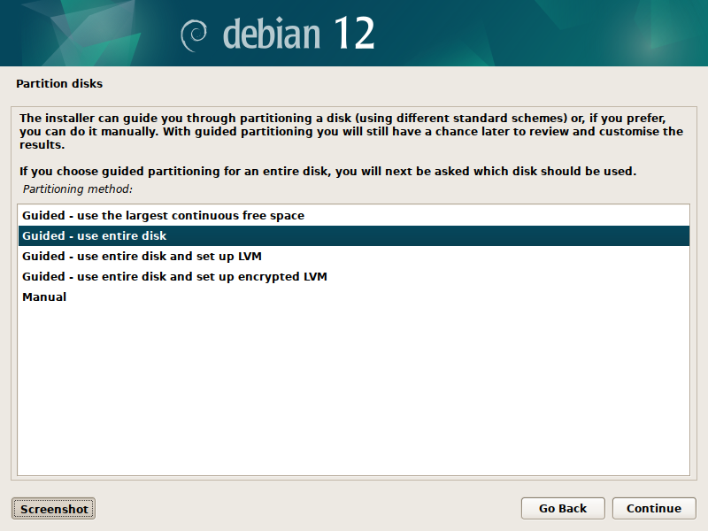<figcaption></figcaption></figure>

18. Select the "/dev/nvme0n1" disk and click "Continue".

<figure>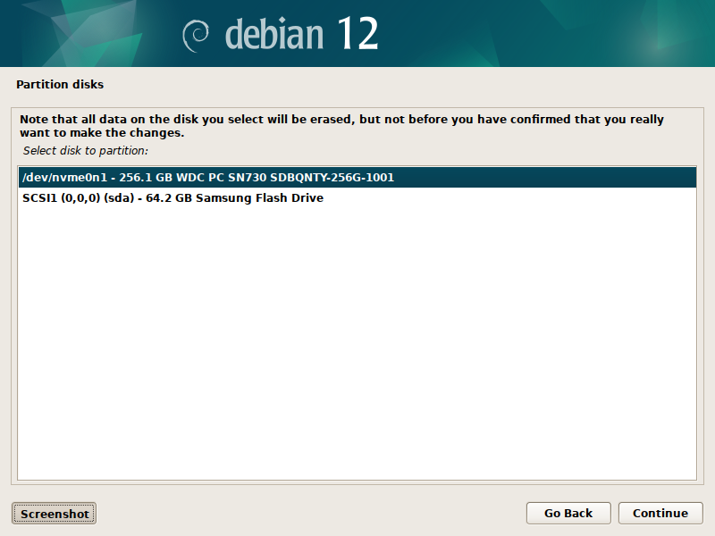<figcaption></figcaption></figure>

19. Select "All files in one partition" and click "Continue".

<figure>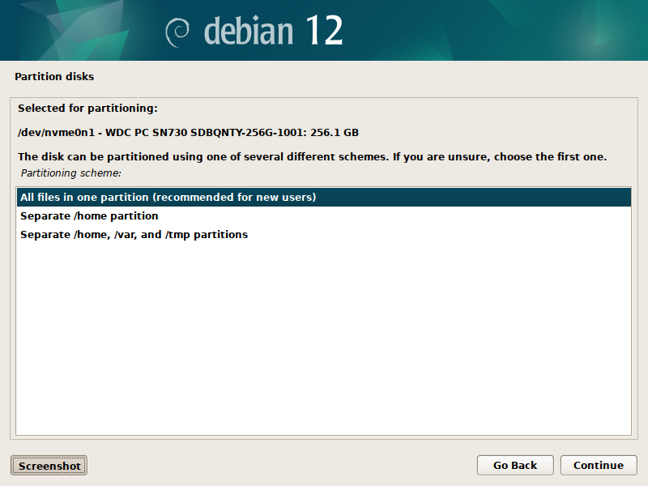<figcaption></figcaption></figure>

20. Select "Finish partitioning and write changes to disk" and click "Continue".

<figure>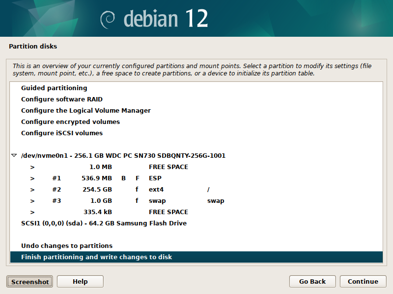<figcaption></figcaption></figure>

21. Select "Yes" and click "Continue".

<figure>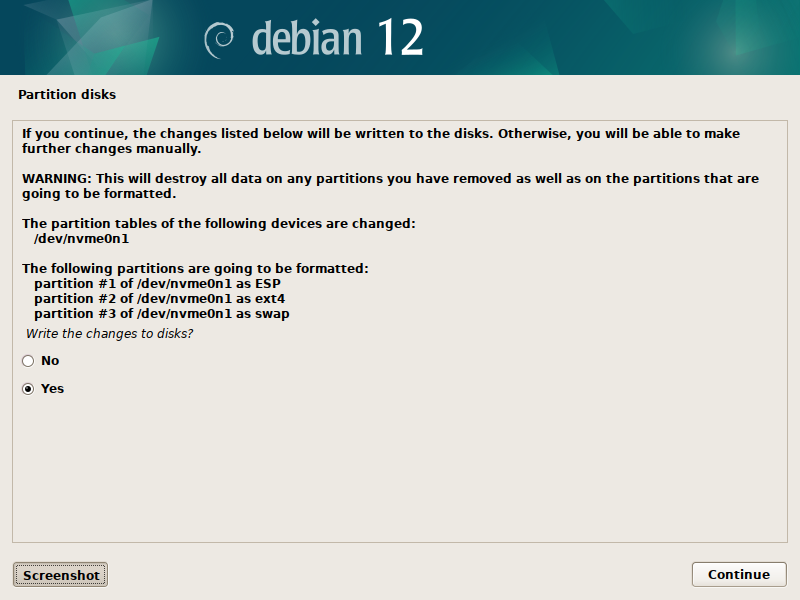<figcaption></figcaption></figure>

22. The base OS installation will now begin. During the installation you will be asked to answer questions related to package management.
23. Select "United States" and click "Continue".
24. Select "deb.debian.org" and click "Continue".
25. Leave the proxy information blank and click "Continue".
26. You will be asked to configure "popularity-contest". Select "No" and click "Continue".
27. The installation process will continue. Once it completes, you will be presented with a final screen confirming that it was successful.
28. Remove the USB drive and click "Continue".
29. The system will reboot and automatically start Debian 12.
30. Log in with the "vx" user and password you created during the installation process.
31. Several basic configuration prompts will be displayed. Select "Next".
32. Select your keyboard preference and click "Next".
33. Turn off Location Services and click "Next".
34. Do not configure any online accounts. Select "Skip".
35. Click the "Start Using Debian GNU/Linux" button. The dialog will be closed.

## **Grant Sudo Privileges**

The "vx" user needs to be granted sudo privileges related to configuring and initializing the build environment tools.

1. Open a terminal window.
2. As the "vx" user, you will temporarily log in to the "root" account.

```
su -
<Enter root user password>
```

3. You will see your terminal window prompt change to "root@VxBuild". To grant the "vx" user sudo privileges, run the following command as root.

```
echo "vx ALL=NOPASSWD: ALL" > /etc/sudoers.d/vx
exit
```

4. You will see your terminal window prompt change to "vx@VxBuild". You are now the "vx" user instead of the "root" user. To confirm sudo privileges, run the following command:

```
sudo whoami
```

5. The command should return "root". This confirms sudo privileges have been granted correctly.
