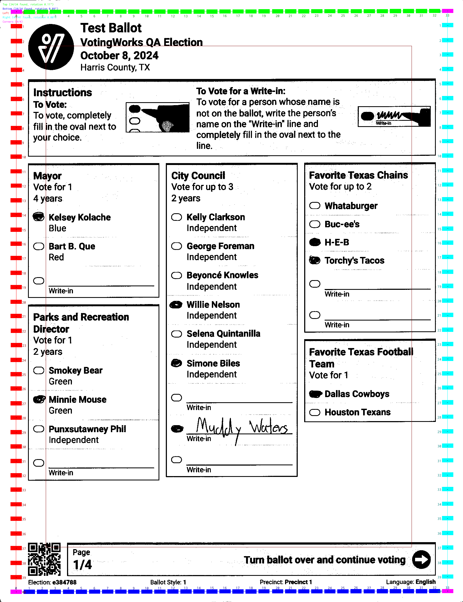

# Ballot Interpretation

Ballot interpretation begins with an image of the ballot transmitted from the scanner. Once the image is available to the application, it starts by trying to interpreting the ballot as a [hand marked ballot](hand-marked-ballots.md).

Before trying to make sense of the ballot, the interpreter checks the image for vertical streaks. Vertical streaks likely indicate some sort of smudge or debris in the scanner that could interfere with the ballot image. The interpreter looks for columns of black without gaps, excluding the edges of the ballot which may be black simply from the way the scanner creates images.

<figure><figcaption>
Vertical streak detected
</figcaption></figure>

 

<figure><figcaption>
No vertical streak detected
</figcaption></figure>

If a streak is detected, the interpreter exits and surfaces the error to the application which will alert the user.

The interpreter then identifies the timing mark grid. It begins by finding all shapes in the image. It then narrows the list of shapes down to ones that look like timing marks and then further narrows the list down to timing mark shapes that fall along the edges of the image in a line.

<figure><figcaption>
All shapes
</figcaption></figure>

 

<figure><figcaption>
Timing mark shapes
</figcaption></figure>

 

<figure><figcaption>
Timing mark shapes along edges
</figcaption></figure>

As in the example above, the interpreter might not have found all timing marks at this point. It infers any missing timing marks and identifies the corners in order to construct a complete timing mark grid. If at any point the interpreter does not have enough information to comfortably find the complete mark grid or if the detected grid is too rotated or skewed, it exits which causes the application to reject the ballot. In the current example, all timing marks were found initially so no inference is needed to construct the grid.

<figure><figcaption>
Timing mark grid
</figcaption></figure>

Next the interpreter will search the bottom left and top right corners of the image for a QR code. Since ballots have QR codes in the bottom left corner, the location of the QR code determines the correct orientation of the ballot and the interpreter can flip the images right-side up if necesssary:

<figure><figcaption>
QR code search
</figcaption></figure>

 

<figure><figcaption>
Correctly oriented ballot
</figcaption></figure>

The QR code includes ballot metadata - precinct, ballot style, election hash, ballot mode - but no vote information (see [hand-marked-ballots.md](hand-marked-ballots.md "mention")). Up until now, the two sides of a ballot have been interpreted in parallel. At this point, the QR code metadata on the front and back are compared to ensure that they match to form a valid ballot. The ballot information from the QR code indicates which ballot layout from the election definition that the ballot conforms to, including the position of all the bubbles, contests, and write-in areas.

Now that the interpreter can inspect the locations of all ballot bubbles to see how filled they are. Note that bubbles are not necessarily aligned with timing marks because they can be defined in fractional grid coordinates. Each bubble is compared with a bubble template to distinguish voter marks from the bubble itself and is scored accordingly. An empty bubble would receive close to, but not exactly, a 0% score.&#x20;

<figure><figcaption>
Ballot bubble scores
</figcaption></figure>

The bubble scores are later compared against the definite mark threshold in the system settings and used to determine whether the voter made an indication that should be counted. The recommended default threshold is 7%. Setting too low of a threshold may result in stray marks or ballot folds to be considered as marks. Setting too high of a threshold may result in reasonable voter marks not being detected. While ballot instructions should recommend voters fully fill in the bubbles, at a threshold of 7% the system will detect most voter marks that pass through the bubble.

<figure><figcaption>
Valid Marks
</figcaption></figure>

 

<figure><figcaption>
Invalid Marks
</figcaption></figure>

After bubbles are scored, the interpreter will then determine the location of the contest options relative to the grid. The write-in areas are defined in the election definition relative to the contest option areas. The write-in areas are then scored, similarly to the bubbles. This step only occurs in jurisdictions allowing unmarked (unbubbled) write-ins because otherwise a write-in is valid based only on the bubble. Write-in areas that cross the write-in area threshold set in the system settings will be shown in the write-in adjudication flow in VxAdmin. The system's default write-in area threshold is 5%.

<figure><figcaption>
Identifying contest options
</figcaption></figure>

 

<figure><figcaption>
Scoring write-in areas
</figcaption></figure>

After all bubbles and write-in areas are scored, interpretation is complete and the images are saved to disk. The votes are inferred from the bubbles based on the mark thresholds and eventually exported to cast vote records.

If interpretation didn't work, one possibility is that the ballot is actually a [machine marked ballot](machine-marked-ballots.md), so the interpreter will then attempt to interpret the ballot as a machine marked ballot. Since votes are encoded into the QR code, the interpreter only has to find the QR code. It searches the entire document for a QR code. By searching the top and bottom half separately, it can infer the orientation of the ballot because machine marked ballots have QR codes in the top right.
