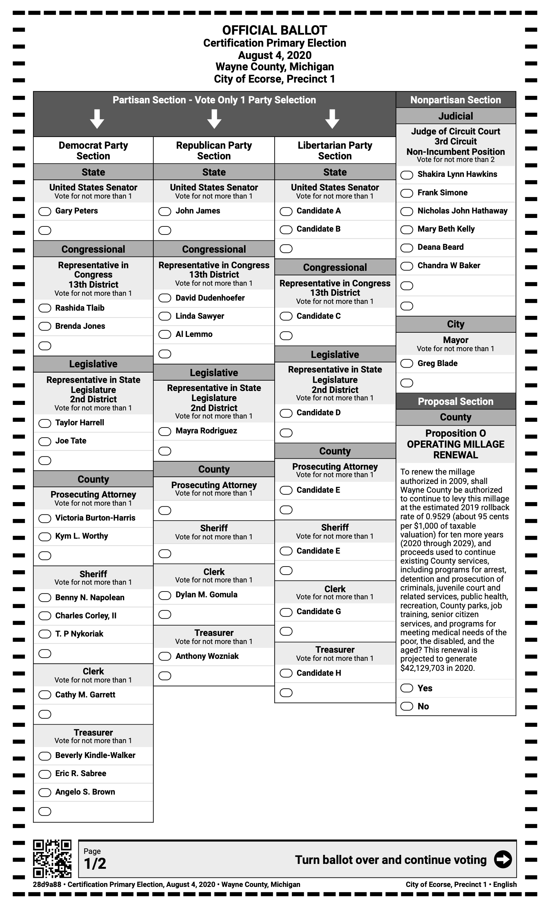
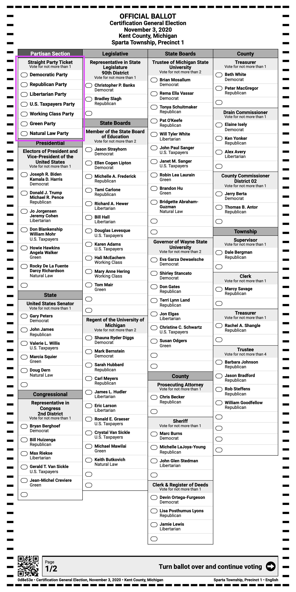

# Election and Contest Type Variations

## Election Types

VxSuite supports general and primary elections. A general election is one in which there is a single ballot style for each geopolitical subdivision, with contests that are not specific to a party. A standard primary election is one in which there is distinct a ballot style per party for each geopolitical subdivision. The primaries run on VxSuite may be either "open" or "closed" depending on how voters procedurally choose their party. The majority of elections run on VxSuite are one of these two types of elections, so the majority of the technical data package and user manual are focused on them.

There is one additional supported election type, which VotingWorks calls a "consolidated ballot open primary." In a consolidated ballot open primary, there is only one ballot style per geopolitical subdivision, as in a general. Each ballot style contains the races from all parties in the primary, however, and the voter chooses to vote in one of them. Consolidated primary ballots mean that the secret ballot includes the voters' choice of party.

### Consolidated Ballot Open Primaries

The purpose of this section is to indicate the ways in which consolidated ballot open primaries behave distinctly from other types of elections.

<figure><figcaption>
Consolidated Primary Ballot
</figcaption></figure>

#### Bubble Ballots & Voter Warnings

Consolidated primary ballots can require voters to indicate their party choice explicitly in a "party preference contest" or require voters to indicate their party by simply voting in that their party's contests. VxSuite does not currently support party preference contests, so the choice of party is always indicated by the votes themselves.

The voter may only vote in one party's contests. Voting in more than one party's contests is considered **crossover voting** and invalidates all votes in partisan contests. Votes in nonpartisan contests are always counted regardless of crossover voting.

Both VxScan and VxCentralScan warn when crossover voting is detected. VxScan shows a message to the voter and gives them the option to return or cast their ballot. VxCentralScan stops on crossover voted ballots, presents the ballot image and message to the operator, and gives them the option to tabulate or remove the ballot. The user experience on both components is nearly the same as the user experience for overvotes if overvote adjudication is turned on in the system settings.

#### Ballot Marking Device Experience

VxMark and VxMarkScan have unique voting flows for consolidated primary ballots. The voting flow does not allow crossover voting, similar to not allowing overvotes.

The first selection a voter makes on VxMark for a consolidated primary ballot is a party selection. After the voter selects a party, they continue on to vote in that party's contests. They will not be presented the contests of any other party. After the partisan contests, all voters are presented with any nonpartisan contests in the ballot style.

Voters may navigate back to change their party at any time. When the party is changed, any and all previously selected votes are cleared.

Summary ballots include all contests for all parties for consistency with the bubble ballot. Contests for the other parties will appear as "no selection".

#### Tabulation

The results and reports for a consolidated ballot open primary are structured in the same way as a standard primary - tally reports are split into party sections and, if there are nonpartisan races, there will be a separate nonpartisan section.

With a consolidated primary ballot, however, the party of the ballot is not determined by the ballot style. The party of the ballot is determined at the time of tabulation by the interpreted or adjudicated votes on the ballot. If there are no votes for any partisan contests or if there is crossover voting, the ballot will not count toward any party's primary.

In tally reports for consolidated ballot primary elections, the ballot count of the party sections may sum up to less than the ballot count of the nonpartisan contests section. Ballots that are crossover voted or contain no votes in partisan contests account for the difference. In ballot count reports at VxAdmin, those ballots are grouped under "No Party".

A partisan contest is only considered undervoted if the ballot is for the given party. For example, a ballot with votes for Republicans will not contribute to the undervote count in the Democratic primary.

Another consequence of the fact that the party of the ballot is determined at the time of tabulation is that adjudication can increase the number of ballots for a given party. If a ballot has votes for the Republican contests and one stray mark in a Libertarian contest, it will appear in adjudication as a crossover ballot. If that stray mark is adjudicated as invalid, the ballot and all of its votes will count in the Republican primary.

#### Limitations

* Consolidated primary ballots cannot span multiple sheets because, without unique identifiers, it is not possible to prevent crossover voting across sheets
* VxSuite supports consolidated primary ballots with two or three parties
* Manual tally entry is not supported when using consolidated primary ballots

## Contest Types

The two most common supported contest types are:

* N-of-M contests, which are typically candidate contests
* Yes-No contests, also known as ballot propositions or ballot measures

VxSuite additionally supports straight party voting.

### Straight Party Voting

In a "straight party contest", the voter may select no more than one party. For any partisan contests, "indirect votes" will be awarded to candidates of that party if applicable. Straight party contests only appear in general elections.

<figure><figcaption></figcaption></figure>

#### Tabulation

If the straight party contest is undervoted or overvoted, tabulation for all other contests behaves normally. If there is a valid vote in the straight party contest, then straight party rules are applied to all partisan contests. In the general election context, "partisan contests" are defined as any contest with party-associated candidates. Nonpartisan contests would be ballot measures or nonpartisan candidates races such as many judicial or local races.

Jurisdictions tabulate straight party contests in different ways, but the two main ways are "inclusive" and "exclusive" straight party voting. Voters are always allowed to vote directly in partisan races to override their straight party vote. In "exclusive" straight party voting, any direct vote in a partisan candidate contest invalidates the straight party vote for that contest. A contest cannot have both direct and indirect votes. In "inclusive" straight party voting, a direct vote does not necessarily invalidate straight party voting if it's still applicable to the contest. A contest _can_ have both direct and indirect votes. VxSuite currently supports only the "inclusive" style of tabulation for straight party contest.

The examples below are intended to express how straight party tabulation works. In short, inclusive straight party voting means that in each contest:

1. All valid, direct votes are counted
2. If the number of remaining votes is greater than or equal to the number of candidates with the selected party, indirect votes are awarded to those candidates.

**Vote for 1, Straight Party Tabulation Examples**

| Straight Party Contest Vote                                               | Candidate Contest Vote                                                    | Outcome                                                                                                                                            |
| ------------------------------------------------------------------------- | ------------------------------------------------------------------------- | -------------------------------------------------------------------------------------------------------------------------------------------------- |
|  | .png>)                                  | A vote is counted toward the Democratic candidate. The straight party vote generates an indirect vote.                                             |
|  |  | A vote is counted toward the Democratic candidate. Voters may vote directly for candidates even if it is redundant with their straight party vote. |
|  |  | A vote is counted toward the Republican candidate. The direct vote takes priority over the straight party vote.                                    |

**Vote for N (N > 1), Straight Party Tabulation Examples**

| Straight Party Contest Vote                                                | Candidate Contest Vote                                                     | Outcome                                                                                                                                                                                                                                                       |
| -------------------------------------------------------------------------- | -------------------------------------------------------------------------- | ------------------------------------------------------------------------------------------------------------------------------------------------------------------------------------------------------------------------------------------------------------- |
|   |  | A vote is counted toward each of the Republican candidates. The straight party vote generated multiple indirect votes.                                                                                                                                        |
|  |  | A vote is counted toward each of the Republican candidates. One is a direct vote and one is an indirect vote generated by the straight party vote.                                                                                                            |
|  |  | One vote is counted toward the marked Democratic candidate and one vote is left unused, so the contest ends up undervoted. The straight party vote could not be applied because the tabulator would have had to choose between the two Republican candidates. |
|  |  | One vote is counted toward the marked Republican candidate and one vote is also counted toward the U.S. Taxpayers candidate. Because there is only one candidate for U.S. Taxpayers, the one remaining vote could apply.                                      |

#### Ballot Marking Device Experience

On VxMark and VxMarkScan, the straight party contest itself behaves like any other contest. The voter can always choose to leave it blank but they are prevented from overvoting it.

If a selection is made in the straight party contest, affected contests will show an indication of which candidates are receiving indirect votes via the straight party vote. As on a paper ballot, BMD voters can make direct votes in affected contests which will be tabulated according to the rules described above. As on a paper ballot, BMD voters can only cancel out a straight party vote by making other selections directly.

Summary ballots show "no selection" for contests where straight party votes will generate votes in tabulation for consistency with the bubble ballot.

#### Limitations

Ballots with straight party contests cannot span multiple sheets because, without unique identifiers, it is not possible to apply straight party votes across sheets.
