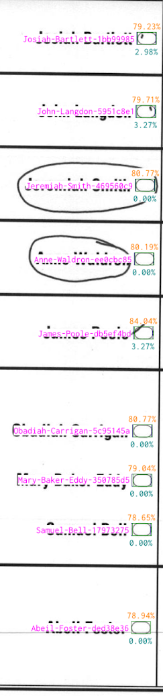

---
layout:
  title:
    visible: true
  description:
    visible: false
  tableOfContents:
    visible: true
  outline:
    visible: true
  pagination:
    visible: true
---

# VxSuite Election Definition

The VxSuite Election Definition is a data format for defining an election that is specific to VxSuite.  It is a JSON file which defines the essential features of an election - metadata, contests, parties, precincts, districts, ballot styles, candidates, and more. In addition to defining that basic structure of the election, the format contains translations for any text which may appear on the ballots and ballot layouts to map the bubbles on each ballot to contest options.

## Core Election Attributes and Relationships

<figure><figcaption><p>Election Entity Relationship Diagram</p></figcaption></figure>

### Election (Election)

The `Election` entity is the top-level entity that contains all other entities.

<table><thead><tr><th width="199">Attribute</th><th>Type</th><th>Description</th></tr></thead><tbody><tr><td><code>ballotLayout</code></td><td><a href="vxsuite-election-definition.md#ballot-layout">Ballot Layout</a></td><td>Physical ballot metadata</td></tr><tr><td><code>ballotStrings</code></td><td><code>array</code> - <a href="vxsuite-election-definition.md#ballot-strings">Ballot Strings</a></td><td><a href="vxsuite-election-definition.md#ballot-strings">See Ballot Strings Section</a></td></tr><tr><td><code>ballotStyles</code></td><td><code>array</code> - <a href="vxsuite-election-definition.md#ballot-style">Ballot Style</a></td><td>All ballot styles</td></tr><tr><td><code>contests</code></td><td><code>array</code> - <a href="vxsuite-election-definition.md#contest">Contest</a></td><td>All contests</td></tr><tr><td><code>gridLayouts</code></td><td><code>array</code> - <a href="vxsuite-election-definition.md#grid-layouts">Grid Layouts</a></td><td><a href="vxsuite-election-definition.md#grid-layouts">See Grid Layouts Section</a></td></tr><tr><td><code>county</code></td><td><a href="vxsuite-election-definition.md#county">County</a></td><td>County metadata</td></tr><tr><td><code>date</code></td><td><code>string</code> - YYYY-MM-DD</td><td>Date of the election</td></tr><tr><td><code>districts</code></td><td><code>array</code> - <a href="vxsuite-election-definition.md#district">District</a></td><td>All districts</td></tr><tr><td><code>id</code></td><td><code>string</code></td><td>Unique identifier</td></tr><tr><td><code>parties</code></td><td><code>array</code> - <a href="vxsuite-election-definition.md#party">Party</a></td><td>All parties</td></tr><tr><td><code>precincts</code></td><td><code>array</code> - <a href="vxsuite-election-definition.md#precinct">Precinct</a></td><td>All precincts</td></tr><tr><td><code>seal</code></td><td><code>string</code> - SVG file format</td><td>Seal for the election</td></tr><tr><td><code>state</code></td><td><code>string</code></td><td>Name of the state</td></tr><tr><td><code>title</code></td><td><code>string</code></td><td>Title of the election</td></tr><tr><td><code>type</code></td><td><code>string</code> - "general" or "primary"</td><td>Type of the election</td></tr></tbody></table>

### Ballot Layout (BallotLayout)

The ballot layout entity includes basic information about the physical ballots used for the election.

<table><thead><tr><th width="223">Attribute</th><th width="196">Type</th><th>Description</th></tr></thead><tbody><tr><td><code>paperSize</code></td><td><code>string</code></td><td>Indicates physical length of the ballot</td></tr><tr><td><code>metadataEncoding</code></td><td><code>string</code></td><td>Indicates how the ballot metadata will be encoded on the ballot</td></tr></tbody></table>

The `paperSize` attribute accepts the following valid options:&#x20;


```
letter, legal, custom-8.5x17, custom-8.5x18, custom-8.5x21, custom-8.5x22
```


The `metadataEncoding` attribute must be "qr-code".&#x20;

### Ballot Style (BallotStyle)

Each ballot style corresponds to a single- or multi-sheet ballot. The contests on a ballot style are determined by its associated districts - every contest belonging to an associated district is considered a part of the ballot style. A ballot style may be used in multiple precincts, one ballot style might correspond to multiple ballot PDFs that have identical contest layouts but different precinct labels.

<table><thead><tr><th width="154.33333333333331">Attribute</th><th width="229">Type</th><th>Description</th></tr></thead><tbody><tr><td><code>id</code></td><td><code>string</code></td><td>Unique identifier</td></tr><tr><td><code>precincts</code></td><td><code>array</code> - IDs for <a href="vxsuite-election-definition.md#precinct">Precinct</a></td><td>The IDs of all precincts which use the ballot style</td></tr><tr><td><code>districts</code></td><td><code>array</code> - IDs for <a href="vxsuite-election-definition.md#district">District</a></td><td>The IDs of all districts whose contests are included in the ballot style</td></tr><tr><td><code>partyId</code></td><td><code>string</code> - ID for <a href="vxsuite-election-definition.md#party">Party</a></td><td>Optional. The ID of the party to which the ballot belongs, if a primary</td></tr><tr><td><code>languages</code></td><td><code>array</code> - <code>string</code></td><td>Optional. The language codes for the languages covered by the ballot style</td></tr></tbody></table>

### Contest (Contest)

There are two types of contests - candidate contests and yes-no contests. Both types share core attributes:

<table><thead><tr><th width="172">Attribute</th><th width="229">Type</th><th>Description</th></tr></thead><tbody><tr><td><code>id</code></td><td><code>string</code></td><td>Unique identifier</td></tr><tr><td><code>districtId</code></td><td><code>string</code> - ID for <a href="vxsuite-election-definition.md#district">District</a></td><td>The associated district of the contest such as a state, county, or ward</td></tr><tr><td><code>title</code></td><td><code>string</code></td><td>Title of the contest</td></tr><tr><td><code>type</code></td><td><code>string</code> - "candidate" or "yesno"</td><td>Type of the contest</td></tr></tbody></table>

#### Candidate Contest (CandidateContest)

In a candidate contest, the voter makes a selection between pre-defined candidates or write-in options. The following attributes extend the shared [Contest](vxsuite-election-definition.md#contest) attributes:

<table><thead><tr><th width="200">Attribute</th><th width="201">Type</th><th>Description</th></tr></thead><tbody><tr><td><code>seats</code></td><td><code>number</code></td><td>The number of selections a voter can make</td></tr><tr><td><code>candidates</code></td><td><code>array</code> - <a href="vxsuite-election-definition.md#candidate">Candidate</a></td><td>Candidate options for the contest</td></tr><tr><td><code>allowWriteIns</code></td><td><code>boolean</code></td><td>Whether the contest allows write-ins</td></tr><tr><td><code>partyId</code></td><td><code>string</code> - ID for <a href="vxsuite-election-definition.md#party">Party</a></td><td>Optional. The ID of the party to which the contest belongs, if a primary</td></tr><tr><td><code>termDescription</code></td><td><code>string</code></td><td>Optional. Description of the term of the position, such as "For three years" </td></tr></tbody></table>

#### Candidate (Candidate)

<table><thead><tr><th width="196">Attribute</th><th width="207">Type</th><th>Description</th></tr></thead><tbody><tr><td><code>id</code></td><td><code>string</code></td><td>Unique identifier</td></tr><tr><td><code>name</code></td><td><code>string</code></td><td>Name as it appears on the ballot</td></tr><tr><td><code>partyIds</code></td><td><code>array</code> - ID for <a href="vxsuite-election-definition.md#party">Party</a></td><td>Optional. The IDs of the parties associated with the candidate. The party name will appear next to the candidate</td></tr><tr><td><code>isWriteIn</code></td><td><code>boolean</code></td><td>Optional. Whether the candidate is a write-in candidate</td></tr><tr><td><code>writeInIndex</code></td><td><code>number</code></td><td>Optional. Where multiple write-in positions appear on a ballot, indicates the index of the current candidate (0-indexed)</td></tr></tbody></table>

#### Yes-No Contest (YesNoContest)

In a yes-no contest, also known as a ballot measure, the voter makes a selection between two options. The following attributes extend the shared [Contest](vxsuite-election-definition.md#contest) attributes:

<table><thead><tr><th width="158">Attribute</th><th width="229">Type</th><th>Description</th></tr></thead><tbody><tr><td><code>id</code></td><td><code>string</code></td><td>Contest description</td></tr><tr><td><code>yesOption</code></td><td><a href="vxsuite-election-definition.md#yes-no-contest-option">Yes-No Contest Option</a></td><td>"Yes" option</td></tr><tr><td><code>noOption</code></td><td><a href="vxsuite-election-definition.md#yes-no-contest-option">Yes-No Contest Option</a></td><td>"No" option</td></tr></tbody></table>

#### Yes-No Contest Option (YesNoContestOption)

<table><thead><tr><th width="145">Attribute</th><th width="120">Type</th><th>Description</th></tr></thead><tbody><tr><td><code>id</code></td><td><code>string</code></td><td>Unique Identifier</td></tr><tr><td><code>label</code></td><td><code>string</code></td><td>Label e.g. "Yes" or "No"</td></tr></tbody></table>

### County (County)

One and only one county is associated with each election.

<table><thead><tr><th width="159">Attribute</th><th width="152">Type</th><th>Description</th></tr></thead><tbody><tr><td><code>id</code></td><td><code>string</code></td><td>Unique Identifier</td></tr><tr><td><code>name</code></td><td><code>string</code></td><td>Name e.g. "Choctaw County"</td></tr></tbody></table>

### District (District)

Districts are used to define levels at which a contest takes place. For example, an election may have districts defined for the state, county, town, and ward levels. Different contests can be associated with each of those levels.

<table><thead><tr><th width="152">Attribute</th><th width="141">Type</th><th>Description</th></tr></thead><tbody><tr><td><code>id</code></td><td><code>string</code></td><td>Unique Identifier</td></tr><tr><td><code>name</code></td><td><code>string</code></td><td>Name e.g. "State of Mississippi"</td></tr></tbody></table>

### Party (Party)

Parties are used in the data model either to associate candidates with a party, associate ballot styles with a party for a primary, associate contests with a party for a primary

<table><thead><tr><th width="203">Attribute</th><th width="229">Type</th><th>Description</th></tr></thead><tbody><tr><td><code>id</code></td><td><code>string</code></td><td>Unique Identifier</td></tr><tr><td><code>name</code></td><td><code>string</code></td><td>Short name which will appear on the ballot besides candidates e.g. "Republican"</td></tr><tr><td><code>fullName</code></td><td><code>string</code></td><td>Full name which will appear in reports and in the titles of ballots e.g. "Democratic Party"</td></tr><tr><td><code>abbrev</code></td><td><code>string</code></td><td>Abbreviation for a party e.g. "R"</td></tr></tbody></table>

### Precinct (Precinct)

<table><thead><tr><th width="203">Attribute</th><th width="229">Type</th><th>Description</th></tr></thead><tbody><tr><td><code>id</code></td><td><code>string</code></td><td>Unique Identifier</td></tr><tr><td><code>name</code></td><td><code>string</code></td><td>Name e.g. "Fire Station"</td></tr></tbody></table>

## Ballot Strings

The `ballotStrings` object contains the translations for any text which may appear on the ballot. The text falls into one of two categories: instructional text or election-specific text.

### Instructional Text

Examples of instructional ballot text include:

* "To vote, completely fill in the oval next to your choice."
* "Vote for up to 3",
* "Official Absentee Ballot"

Although the system does not use the hand marked ballot instructional text for any purpose, it must be included in the election definition for security purposes. When included, it becomes a part of the [ballot hash](./#election-package-and-ballot-hashes) and cannot be changed without invalidating older ballots.

### Election-Specific Text

The core data model includes already includes names and labels. For example, the [Precinct](vxsuite-election-definition.md#precinct) entity already has a `name` attribute. The names within the data model are used by default in the system in reports and administrative menus. The translations for all of these names are within the `ballotStrings` and are important for two main reasons:

1. The language-specific strings are used to accommodate multi-lingual voting on VxMark
2. Including the translations in the election definition means they are included in the [ballot hash](./#election-package-and-ballot-hashes) and cannot be changed without invalidating older ballots.

The election-specific `ballotStrings` recognized by the system are the following:

| Description           | Key                  | Value                                                                                                               |
| --------------------- | -------------------- | ------------------------------------------------------------------------------------------------------------------- |
| Ballot Language       | `ballotLanguage`     | `string`                                                                                                            |
| Ballot Style IDs      | `ballotStyleId`      | key-value pairs, [Ballot Style](vxsuite-election-definition.md#ballot-style) IDs mapped to names                    |
| Candidate Names       | `candidateName`      | key-value pairs, [Candidate](vxsuite-election-definition.md#candidate) IDs mapped to names                          |
| Contest Descriptions  | `contestDescription` | key-value pairs, [Contest](vxsuite-election-definition.md#contest) IDs mapped to descriptions                       |
| Contest Option Labels | `contestOptionLabel` | key-value pairs, [Yes-No Contest Option](vxsuite-election-definition.md#yes-no-contest-option) IDs mapped to labels |
| Contest Terms         | `contestTerm`        | key-value pairs, [Contest](vxsuite-election-definition.md#contest) IDs mapped to term descriptions                  |
| Contest Titles        | `contestTitle`       | key-value pairs, [Contest](vxsuite-election-definition.md#contest) IDs mapped to titles                             |
| County Name           | `countyName`         | `string`                                                                                                            |
| District Names        | `districtName`       | key-value pairs, [District](vxsuite-election-definition.md#district) IDs mapped to names                            |
| Election Date         | `electionDate`       | `string`                                                                                                            |
| Election Title        | `electionTitle`      | `string`                                                                                                            |
| Party Full Names      | `partyFullName`      | key-value pairs, [Party](vxsuite-election-definition.md#party) IDs mapped to their full names                       |
| Party Names           | `partyName`          | key-value pairs, [Party](vxsuite-election-definition.md#party) IDs mapped to their short names                      |
| Precinct Names        | `precinctName`       | key-value pairs, [Precinct](vxsuite-election-definition.md#precinct) IDs mapped to names                            |
| State Name            | `stateName`          | `string`                                                                                                            |

### Example

```json
{
  "ballotStrings": {
    "en": {
       ...
      "candidateNames": {
         "john-doe": "John Doe",
         "jane-doe": "Jane Doe".
         ...
      },
      "electionTitle": "General Election",
      "hmpbOfficialBallot": "Official Ballot",
      ...
    }
    "es-US": {
      ...
      "candidateNames": {
         "john-doe": "John Doe",
         "jane-doe": "Jane Doe".
         ...
      },
      "electionTitle": "Elecciones generales",
      "hmpbOfficialBallot": "Boleta oficial",
      ...
    }
  },
  ...
}
```

The language codes used are the [IETF language tags](https://www.w3.org/International/articles/language-tags/) for supported VxSuite languages: English, Spanish, Simplified Chinese, and Traditional Chinese.

## Grid Layouts

Grid layouts describe where the bubbles and write-in areas exist on each ballot style. They must correspond exactly to the ballots used for the election in order for interpretation to succeed. For more information on the acceptable ballot format and its relationship to grid coordinates, see [Hand Marked Ballots](../hand-marked-ballots.md).

<figure><figcaption><p>Relationship of grid layouts to other entities in the election definition</p></figcaption></figure>

`gridLayouts` is an `array` which contains entities with the following attributes:

<table><thead><tr><th width="316">Attribute</th><th width="166">Type</th><th>Description</th></tr></thead><tbody><tr><td><code>ballotStyleId</code></td><td><code>string</code>, ID for <a href="vxsuite-election-definition.md#ballot-style">Ballot Style</a></td><td>Identifies the ballot style</td></tr><tr><td><code>optionBoundsFromTargetMark</code></td><td>Outset</td><td>Describes where the entire contest option area sits relative to the bubble</td></tr><tr><td><code>gridPositions</code></td><td>Grid Position</td><td>Describes bubble and write-in positions on the ballot</td></tr></tbody></table>

### Outset (Outset)

The `optionBoundsFromTargetMark` field specifies an `Outset` entity. The purpose is to give the distance from the bubble to edges of the entire contest option e.g. the area that includes the bubble, the corresponding candidate's name, and some padding. The system uses this area during write-in-adjudication to highlight specific contest options for review.

<table><thead><tr><th width="143">Attribute</th><th width="104">Type</th><th>Description</th></tr></thead><tbody><tr><td><code>top</code></td><td><code>number</code></td><td>Distance from top of bubble to top of option bounds</td></tr><tr><td><code>right</code></td><td><code>number</code></td><td>Distance from right of bubble to right of option bounds</td></tr><tr><td><code>bottom</code></td><td><code>number</code></td><td>Distance from bottom of bubble to bottom of option bounds</td></tr><tr><td><code>left</code></td><td><code>number</code></td><td>Distance between left of bubble and left of option bounds</td></tr></tbody></table>

### Grid Position (GridPosition)

Grid positions are defined positions on the ballot corresponding to bubbles that can be marked by a voter. There are two types of positions - a standard option position corresponding to a candidate or option in the election definition or a write-in position corresponding to a write-in bubble and area on the ballot.

#### Option Grid Position (GridPositionOption)

<table><thead><tr><th width="171">Attribute</th><th width="234">Type</th><th>Description</th></tr></thead><tbody><tr><td><code>type</code></td><td><code>string</code> - "option"</td><td>Indicates this is a standard option position</td></tr><tr><td><code>sheetNumber</code></td><td><code>number</code></td><td>1-indexed sheet number within the ballot style</td></tr><tr><td><code>side</code></td><td><code>string</code> - "front" or "back"</td><td>Indicates side of the sheet</td></tr><tr><td><code>column</code></td><td><code>number</code></td><td>Column position of the bubble in the timing mark grid</td></tr><tr><td><code>row</code></td><td><code>number</code></td><td>Row position of the bubble in the timing mark grid</td></tr><tr><td><code>contestId</code></td><td><code>string</code> - ID of <a href="vxsuite-election-definition.md#contest">Contest</a></td><td>Contest identifier</td></tr><tr><td><code>optionId</code></td><td><code>string</code> - ID of <a href="vxsuite-election-definition.md#candidate">Candidate</a> or<a href="vxsuite-election-definition.md#yes-no-contest-option"> Yes-No Contest Option</a></td><td>Option identifier</td></tr></tbody></table>

#### Write-In Grid Position (GridPositionWriteIn)

<table><thead><tr><th width="174">Attribute</th><th width="237">Type</th><th>Description</th></tr></thead><tbody><tr><td><code>type</code></td><td><code>string</code> - "write-in"</td><td>Indicates this is a write-in option position</td></tr><tr><td><code>sheetNumber</code></td><td><code>number</code></td><td>1-indexed sheet number within the ballot style</td></tr><tr><td><code>side</code></td><td><code>string</code> - "front" or "back"</td><td>Indicates side of the sheet</td></tr><tr><td><code>column</code></td><td><code>number</code></td><td>Column position of the bubble in the timing mark grid</td></tr><tr><td><code>row</code></td><td><code>number</code></td><td>Row position of the bubble in the timing mark grid</td></tr><tr><td><code>contestId</code></td><td><code>string</code> - ID of <a href="vxsuite-election-definition.md#contest">Contest</a></td><td>Contest identifier</td></tr><tr><td><code>writeInIndex</code></td><td><code>number</code></td><td>An index of the write-in position within the list of write-in positions for a contest</td></tr><tr><td><code>writeInArea</code></td><td><code>Rect</code></td><td>Area of the ballot to scan for a write-in</td></tr></tbody></table>

In some jurisdictions, a write-in can only be counted if the associated bubble is filled in as for any other option. In other jurisdictions, a write-in must be counted even if the bubble is not filled. In order to detect these write-ins, a `writeInArea` is defined for each write-in grid position. The `Rect` specifies the area.

#### Rectangle (Rect)

<table><thead><tr><th width="143">Attribute</th><th width="104">Type</th><th>Description</th></tr></thead><tbody><tr><td><code>x</code></td><td><code>number</code></td><td>Column start of the rectangle</td></tr><tr><td><code>y</code></td><td><code>number</code></td><td>Row start of the rectangle</td></tr><tr><td><code>width</code></td><td><code>number</code></td><td>Width of the rectangle</td></tr><tr><td><code>height</code></td><td><code>number</code></td><td>Height of the rectangle</td></tr></tbody></table>

## Examples

Election definition examples are located in the `vxsuite` repository, such as [here](https://github.com/votingworks/vxsuite/blob/main/libs/hmpb/fixtures/famous-names/election.json). **(insert link updated).**
