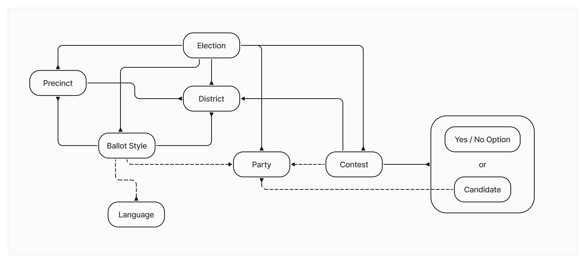

# VxSuite Election Definition

The VxSuite Election Definition is a data format for defining an election that is specific to VxSuite. It is a JSON file which defines the essential features of an election - metadata, contests, parties, precincts, polling places, districts, ballot styles, candidates, and more. In addition to defining that basic structure of the election, the format contains translations for any text which may appear on the ballots and ballot layouts to map the bubbles on each ballot to contest options.

## Core Election Attributes and Relationships

<figure><figcaption><p>Election Entity Relationship Diagram</p></figcaption></figure>

### Election

The `Election` entity is the top-level entity that contains all other entities.

<table><thead><tr><th width="199">Attribute</th><th>Type</th><th>Description</th></tr></thead><tbody><tr><td><code>ballotLayout</code></td><td><a href="vxsuite-election-definition.md#ballot-layout">Ballot Layout</a></td><td>Physical ballot metadata</td></tr><tr><td><code>ballotStrings</code></td><td><code>array</code> - <a href="vxsuite-election-definition.md#ballot-strings">Ballot Strings</a></td><td><a href="vxsuite-election-definition.md#ballot-strings">See Ballot Strings Section</a></td></tr><tr><td><code>ballotStyles</code></td><td><code>array</code> - <a href="vxsuite-election-definition.md#ballot-style">Ballot Style</a></td><td>All ballot styles</td></tr><tr><td><code>contests</code></td><td><code>array</code> - <a href="vxsuite-election-definition.md#contest">Contest</a></td><td>All contests</td></tr><tr><td><code>jurisdiction</code></td><td><a href="vxsuite-election-definition.md#jurisdiction">Jurisdiction</a></td><td>Jurisdiction metadata</td></tr><tr><td><code>date</code></td><td><code>string</code> - YYYY-MM-DD</td><td>Date of the election</td></tr><tr><td><code>districts</code></td><td><code>array</code> - <a href="vxsuite-election-definition.md#district">District</a></td><td>All districts</td></tr><tr><td><code>id</code></td><td><code>string</code></td><td>Unique identifier</td></tr><tr><td><code>parties</code></td><td><code>array</code> - <a href="vxsuite-election-definition.md#party">Party</a></td><td>All parties</td></tr><tr><td><code>pollingPlaces</code></td><td><code>array</code> - <a href="vxsuite-election-definition.md#polling-place">Polling Place</a></td><td>All polling places</td></tr><tr><td><code>precincts</code></td><td><code>array</code> - <a href="vxsuite-election-definition.md#precinct">Precinct</a></td><td>All precincts</td></tr><tr><td><code>seal</code></td><td><code>string</code> - SVG file format</td><td>Seal for the election</td></tr><tr><td><code>state</code></td><td><code>string</code></td><td>Name of the state</td></tr><tr><td><code>title</code></td><td><code>string</code></td><td>Title of the election</td></tr><tr><td><code>type</code></td><td><code>string</code> - "general", "closed-primary", or "open-primary"</td><td>Type of the election</td></tr></tbody></table>

### Ballot Layout

The ballot layout entity includes basic information about the physical ballots used for the election.

<table><thead><tr><th width="223">Attribute</th><th width="196">Type</th><th>Description</th></tr></thead><tbody><tr><td><code>paperSize</code></td><td><code>string</code></td><td>Indicates physical length of the ballot</td></tr><tr><td><code>metadataEncoding</code></td><td><code>string</code></td><td>Indicates how the ballot metadata will be encoded on the ballot</td></tr></tbody></table>

The `paperSize` attribute accepts the following valid options:


```
letter, legal, custom-8.5x17, custom-8.5x18, custom-8.5x19, custom-8.5x20, custom-8.5x22
```


The `metadataEncoding` attribute must be "qr-code".

### Ballot Style

Each ballot style corresponds to a single- or multi-sheet ballot. The contests on a ballot style are determined by its associated districts - every contest belonging to an associated district is considered a part of the ballot style. A ballot style may be used in multiple precincts, one ballot style might correspond to multiple ballot PDFs that have identical contest layouts but different precinct labels.

<table><thead><tr><th width="154.33333333333331">Attribute</th><th width="248.0703125">Type</th><th>Description</th></tr></thead><tbody><tr><td><code>id</code></td><td><code>string</code></td><td>Unique identifier</td></tr><tr><td><code>groupId</code></td><td><code>string</code></td><td>Identifier grouping ballot styles that are identical except for language</td></tr><tr><td><code>precincts</code></td><td><code>array</code> - IDs for <a href="vxsuite-election-definition.md#precinct">Precinct</a></td><td>The IDs of all precincts which use the ballot style</td></tr><tr><td><code>districts</code></td><td><code>array</code> - IDs for <a href="vxsuite-election-definition.md#district">District</a></td><td>The IDs of all districts whose contests are included in the ballot style</td></tr><tr><td><code>partyId</code></td><td><code>string</code> - ID for <a href="vxsuite-election-definition.md#party">Party</a></td><td>Optional. The ID of the party to which the ballot belongs, if a primary</td></tr><tr><td><code>languages</code></td><td><code>array</code> - <code>string</code></td><td>The language codes for the languages covered by the ballot style</td></tr><tr><td><code>orderedCandidatesByContest</code></td><td><code>map &#x3C;string, array</code> - <code>OrderedCandidateOption></code></td><td><p>Optional. A mapping from contest ID for candidate contests in the ballot style to an ordered list of candidate options that specify the ballot rotation order of candidates for this ballot style. If not specified, candidates will be listed in the order they are defined in the contest object.</p><p><code>OrderedCandidateOption</code> is specified in more detail in the table below.</p></td></tr><tr><td><code>ballotPositions</code></td><td><code>array</code> - <code>SheetPositions</code></td><td>The grid positions (bubble centers and bounding boxes) of every contest and option on this ballot style's bubble ballot, organized by sheet. Absent for ballot styles that have not been laid out (e.g., summary-ballot-only or draft elections). These are described in greater detail under  <a data-mention href="vxsuite-election-definition.md#bubble-ballot-grid-positions">#bubble-ballot-grid-positions</a>.</td></tr></tbody></table>

#### OrderedCandidateOption

| Attribute  | Type               | Description                                        |
| ---------- | ------------------ | -------------------------------------------------- |
| `id`       | `string`           | Candidate ID                                       |
| `partyIds` | `array` - `string` | Endorsement party IDs for the given bubble option. |

A cross-party endorsed candidate may have multiple candidate options associated with the same `id` , but different `partyIds`.

### Contest

There are two types of contests - candidate contests and yes-no contests. Both types share core attributes:

<table><thead><tr><th width="172">Attribute</th><th width="229">Type</th><th>Description</th></tr></thead><tbody><tr><td><code>id</code></td><td><code>string</code></td><td>Unique identifier</td></tr><tr><td><code>districtId</code></td><td><code>string</code> - ID for <a href="vxsuite-election-definition.md#district">District</a></td><td>The associated district of the contest such as a state, county, or ward</td></tr><tr><td><code>title</code></td><td><code>string</code></td><td>Title of the contest</td></tr><tr><td><code>type</code></td><td><code>string</code> - "candidate", "yesno", or "straight-party"</td><td>Type of the contest</td></tr></tbody></table>

#### Candidate Contest

In a candidate contest, the voter makes a selection between pre-defined candidates or write-in options. The following attributes extend the shared [Contest](vxsuite-election-definition.md#contest) attributes:

<table><thead><tr><th width="200">Attribute</th><th width="201">Type</th><th>Description</th></tr></thead><tbody><tr><td><code>seats</code></td><td><code>number</code></td><td>The number of selections a voter can make</td></tr><tr><td><code>candidates</code></td><td><code>array</code> - <a href="vxsuite-election-definition.md#candidate">Candidate</a></td><td>Candidate options for the contest</td></tr><tr><td><code>allowWriteIns</code></td><td><code>boolean</code></td><td>Whether the contest allows write-ins</td></tr><tr><td><code>partyId</code></td><td><code>string</code> - ID for <a href="vxsuite-election-definition.md#party">Party</a></td><td>Optional. The ID of the party to which the contest belongs, if a primary</td></tr><tr><td><code>termDescription</code></td><td><code>string</code></td><td>Optional. Description of the term of the position, such as "For three years"</td></tr></tbody></table>

#### Candidate

<table><thead><tr><th width="196">Attribute</th><th width="207">Type</th><th>Description</th></tr></thead><tbody><tr><td><code>id</code></td><td><code>string</code></td><td>Unique identifier</td></tr><tr><td><code>name</code></td><td><code>string</code></td><td>Name as it appears on the ballot</td></tr><tr><td><code>partyIds</code></td><td><code>array</code> - ID for <a href="vxsuite-election-definition.md#party">Party</a></td><td>Optional. The IDs of the parties associated with the candidate. The party name will appear next to the candidate</td></tr></tbody></table>

#### Ballot Measure Contest

In a ballot measure contest, the voter is presented text and makes a selection between two (or more) options in response, the most common options being "Yes" and "No." The following attributes extend the shared [Contest](vxsuite-election-definition.md#contest) attributes:

| Attribute     | Type                                                                                                    | Description         |
| ------------- | ------------------------------------------------------------------------------------------------------- | ------------------- |
| `description` | `string`                                                                                                | Contest description |
| `options`     | `array` - [Ballot Measure Contest Option](vxsuite-election-definition.md#ballot-measure-contest-option) | Contest options     |

The `description` field supports rich text formatting, including images. Images are represented using the syntax ``, where an image can be converted to a data URL using [https://www.base64-image.de](https://www.base64-image.de/). For example, if an image after conversion via the aforementioned site yields the data URL `data:image/png;base64,iVBORw0KGgoAAAANSUhEUgAAAAEAAAABCAQAAAC1HAwCAAAAC0lEQVR42mP8/x8AAwMCAO1n0X8AAAAASUVORK5CYII=`, the image embedded in a yes-no contest description will look as follows:


```
"description": ""
```


#### Ballot Measure Contest Option

<table><thead><tr><th width="145">Attribute</th><th width="120">Type</th><th>Description</th></tr></thead><tbody><tr><td><code>id</code></td><td><code>string</code></td><td>Unique identifier</td></tr><tr><td><code>label</code></td><td><code>string</code></td><td>Label, e.g., "Yes" or "No"</td></tr></tbody></table>

#### Straight Party Contest

In a [straight party contest](../election-and-contest-type-variations.md#straight-party-voting), the voter selects a party to award votes to that party's candidates in all applicable races. The following attributes extend the shared [Contest](vxsuite-election-definition.md#contest) attributes:

<table><thead><tr><th width="145">Attribute</th><th width="120">Type</th><th>Description</th></tr></thead><tbody><tr><td><code>optionIds</code></td><td><code>array</code> - ID for <a href="vxsuite-election-definition.md#party">Party</a></td><td>An ordered list of IDs of the parties that should appear in the contest</td></tr></tbody></table>

### Jurisdiction

One and only one jurisdiction is associated with each election.

<table><thead><tr><th width="159">Attribute</th><th width="152">Type</th><th>Description</th></tr></thead><tbody><tr><td><code>id</code></td><td><code>string</code></td><td>Unique identifier</td></tr><tr><td><code>name</code></td><td><code>string</code></td><td>Name e.g. "Choctaw County"</td></tr></tbody></table>

### District

Districts are used to define levels at which a contest takes place. For example, an election may have districts defined for the state, county, town, and ward levels. Different contests can be associated with each of those levels.

<table><thead><tr><th width="152">Attribute</th><th width="141">Type</th><th>Description</th></tr></thead><tbody><tr><td><code>id</code></td><td><code>string</code></td><td>Unique identifier</td></tr><tr><td><code>name</code></td><td><code>string</code></td><td>Name e.g. "State of Mississippi"</td></tr></tbody></table>

### Party

Parties are used in the data model to associate candidates with a party, to associate ballot styles with a party for a primary, and to associate contests with a party for a primary.

<table><thead><tr><th width="203">Attribute</th><th width="229">Type</th><th>Description</th></tr></thead><tbody><tr><td><code>id</code></td><td><code>string</code></td><td>Unique identifier</td></tr><tr><td><code>name</code></td><td><code>string</code></td><td>Short name which will appear on the ballot besides candidates e.g. "Republican"</td></tr><tr><td><code>fullName</code></td><td><code>string</code></td><td>Full name which will appear in reports and in the titles of ballots e.g. "Democratic Party"</td></tr><tr><td><code>abbrev</code></td><td><code>string</code></td><td>Abbreviation for a party e.g. "R"</td></tr></tbody></table>

### Polling Place

| Attribute   | Type                                                       | Description                                                                                                                                                                                                                                                                                                         |
| ----------- | ---------------------------------------------------------- | ------------------------------------------------------------------------------------------------------------------------------------------------------------------------------------------------------------------------------------------------------------------------------------------------------------------- |
| `id`        | `string`                                                   | Unique identifier                                                                                                                                                                                                                                                                                                   |
| `name`      | `string`                                                   | Name e.g. "Fire Station"                                                                                                                                                                                                                                                                                            |
| `precincts` | `map <string, PollingPlacePrecinct>`                       | List of all precinct IDs that compose the polling place. Each precinct ID maps to either `{ type: 'whole' }` , which indicates that the whole precinct is part of the polling place, or `{ type: 'partial', splitIds: string[] }` , which indicates which splits from a precinct are included in the polling place. |
| `type`      | `string` - "absentee", "early\_voting", or "election\_day" | Indicates the type of polling place and thus how it will be used in the election.                                                                                                                                                                                                                                   |

### Precinct

| Attribute     | Type                                                                      | Description                                                                                                                                 |
| ------------- | ------------------------------------------------------------------------- | ------------------------------------------------------------------------------------------------------------------------------------------- |
| `id`          | `string`                                                                  | Unique identifier                                                                                                                           |
| `name`        | `string`                                                                  | Name e.g. "Precinct 45"                                                                                                                     |
| `districtIds` | `array` - ID for [District](vxsuite-election-definition.md#district)      | Districts to which the precinct belongs. Not present if `splits` is specified, in which case district associations are specified per split. |
| `splits`      | `array` - [Precinct Split](vxsuite-election-definition.md#precinct-split) | Splits within the precinct. Not present if `districtIds` is specified.                                                                      |

### Precinct Split

| Attribute     | Type                                                                 | Description                                   |
| ------------- | -------------------------------------------------------------------- | --------------------------------------------- |
| `id`          | `string`                                                             | Unique identifier                             |
| `name`        | `string`                                                             | Name e.g. "Precinct Split 1"                  |
| `districtIds` | `array` - ID for [District](vxsuite-election-definition.md#district) | Districts to which the precinct split belongs |

## Ballot Strings

The `ballotStrings` object contains the translations for any text which may appear on the ballot. The text falls into one of two categories: instructional text or election-specific text.

### Instructional Text

Examples of instructional ballot text include:

* "To vote, completely fill in the oval next to your choice."
* "Vote for up to 3",
* "Official Absentee Ballot"

Although the system does not use the hand marked ballot instructional text for any purpose, it must be included in the election definition for security purposes. When included, it becomes a part of the [ballot hash](./#ballot-hash-and-election-package-hash) and cannot be changed without invalidating older ballots.

### Election-Specific Text

The core data model already includes names and labels. For example, the [Precinct](vxsuite-election-definition.md#precinct) entity already has a `name` attribute. The names within the data model are used by default in the system in reports and administrative menus. The translations for all of these names are within the `ballotStrings` and are important for two main reasons:

1. The language-specific strings are used to accommodate multi-lingual voting on VxMarkScan
2. Including the translations in the election definition means they are included in the [ballot hash](./#ballot-hash-and-election-package-hash) and cannot be changed without invalidating older ballots.

The election-specific `ballotStrings` recognized by the system are the following:

| Description           | Key                  | Value                                                                                                               |
| --------------------- | -------------------- | ------------------------------------------------------------------------------------------------------------------- |
| Ballot Language       | `ballotLanguage`     | `string`                                                                                                            |
| Ballot Style IDs      | `ballotStyleId`      | key-value pairs, [Ballot Style](vxsuite-election-definition.md#ballot-style) IDs mapped to names                    |
| Candidate Names       | `candidateName`      | key-value pairs, [Candidate](vxsuite-election-definition.md#candidate) IDs mapped to names                          |
| Contest Descriptions  | `contestDescription` | key-value pairs, [Contest](vxsuite-election-definition.md#contest) IDs mapped to descriptions                       |
| Contest Option Labels | `contestOptionLabel` | key-value pairs, [Yes-No Contest Option](vxsuite-election-definition.md#yes-no-contest-option) IDs mapped to labels |
| Contest Terms         | `contestTerm`        | key-value pairs, [Contest](vxsuite-election-definition.md#contest) IDs mapped to term descriptions                  |
| Contest Titles        | `contestTitle`       | key-value pairs, [Contest](vxsuite-election-definition.md#contest) IDs mapped to titles                             |
| County Name           | `countyName`         | `string`                                                                                                            |
| District Names        | `districtName`       | key-value pairs, [District](vxsuite-election-definition.md#district) IDs mapped to names                            |
| Election Date         | `electionDate`       | `string`                                                                                                            |
| Election Title        | `electionTitle`      | `string`                                                                                                            |
| Party Full Names      | `partyFullName`      | key-value pairs, [Party](vxsuite-election-definition.md#party) IDs mapped to their full names                       |
| Party Names           | `partyName`          | key-value pairs, [Party](vxsuite-election-definition.md#party) IDs mapped to their short names                      |
| Polling Place Names   | `pollingPlaceName`   | key-value pairs, [Polling Place](vxsuite-election-definition.md#polling-place) IDs mapped to names                  |
| Precinct Names        | `precinctName`       | key-value pairs, [Precinct](vxsuite-election-definition.md#precinct) IDs mapped to names                            |
| Precinct Split Names  | `precinctSplitName`  | key-value pairs, [Precinct Split](vxsuite-election-definition.md#precinct-split) IDs mapped to names                |
| State Name            | `stateName`          | `string`                                                                                                            |

### Example

```json
{
  "ballotStrings": {
    "en": {
       ...
      "candidateName": {
         "john-doe": "John Doe",
         "jane-doe": "Jane Doe",
         ...
      },
      "electionTitle": "General Election",
      "hmpbOfficialBallot": "Official Ballot",
      ...
    }
    "es-US": {
      ...
      "candidateName": {
         "john-doe": "John Doe",
         "jane-doe": "Jane Doe",
         ...
      },
      "electionTitle": "Elecciones generales",
      "hmpbOfficialBallot": "Boleta oficial",
      ...
    }
  },
  ...
}
```

The language codes used are [IETF language tags](https://www.w3.org/International/articles/language-tags/).

## Bubble Ballot Grid Positions

We define an abstract grid using the timing marks on the outer edges of the ballot. We then use this grid to define bubble positions and other bounding boxes relevant to ballot interpretation and adjudication UIs.

These are defined on a per-ballot-style basis under each ballot style's `sheetPositions` field.

#### SheetPositions

A tuple of two `ContestPosition` arrays, the first for the front of a sheet and the second for the back of a sheet.

#### ContestPosition

| Attribute   | Type                              | Description                                         |
| ----------- | --------------------------------- | --------------------------------------------------- |
| `contestId` | `string`                          | Contest ID                                          |
| `bounds`    | `GridRect`                        | The bounding box of the contest in grid coordinates |
| `options`   | `array` - `ContestOptionPosition` | Grid position information for the contest options   |

#### ContestOptionPosition

One of `OptionPosition` or `WriteInPosition`.

#### OptionPosition

| Attribute      | Type                | Description                                                      |
| -------------- | ------------------- | ---------------------------------------------------------------- |
| `type`         | `string` - "option" | Indicates that this is a standard (non-write-in) option position |
| `bubbleCenter` | `GridPoint`         | The bubble center in grid coordinates                            |
| `bounds`       | `GridRect`          | The bounding box of the option in grid coordinates               |
| `optionId`     | `string`            | Candidate ID                                                     |
| `partyIds`     | `array` - `string`  | Endorsement party IDs for the given bubble option                |

#### WriteInPosition

| Attribute      | Type                  | Description                                                                                                               |
| -------------- | --------------------- | ------------------------------------------------------------------------------------------------------------------------- |
| `type`         | `string` - "write-in" | Indicates that this is a write-in option position                                                                         |
| `bubbleCenter` | `GridPoint`           | The bubble center in grid coordinates                                                                                     |
| `bounds`       | `GridRect`            | The bounding box of the option in grid coordinates                                                                        |
| `writeInIndex` | `number`              | The zero-indexed index of the write-in within the contest. Always 0 for a vote-for-1. 0 or 1 for a vote-for-2, and so on. |
| `writeInArea`  | `GridRect`            | The area within the option bounds to consider for unmarked write-in detection\* in grid coordinates                       |

\*In some jurisdictions, a write-in can only be counted if the associated bubble is filled in as for any other option. In other jurisdictions, a write-in must be counted even if the bubble is not filled. The `writeInArea` is used for the latter unmarked write-in detection.

#### GridRect

| Attribute | Type     | Description                                      |
| --------- | -------- | ------------------------------------------------ |
| `row`     | `number` | Row start of a rectangle in timing mark units    |
| `column`  | `number` | Column start of a rectangle in timing mark units |
| `width`   | `number` | Width of a rectangle in timing mark units        |
| `height`  | `number` | Height of a rectangle in timing mark units       |

Decimal values are supported. 2.25 means 2 and a quarter timing marks.

#### GridPoint

| Attribute | Type     | Description                                  |
| --------- | -------- | -------------------------------------------- |
| `row`     | `number` | Row index of a point in timing mark units    |
| `column`  | `number` | Column index of a point in timing mark units |

Decimal values are supported. 2.25 means 2 and a quarter timing marks.

## Examples

Election definition examples are located in the `vxsuite` repository, such as [here](https://github.com/votingworks/vxsuite/blob/v4.0.7/libs/hmpb/fixtures/vx-general-election/letter/election.json).
