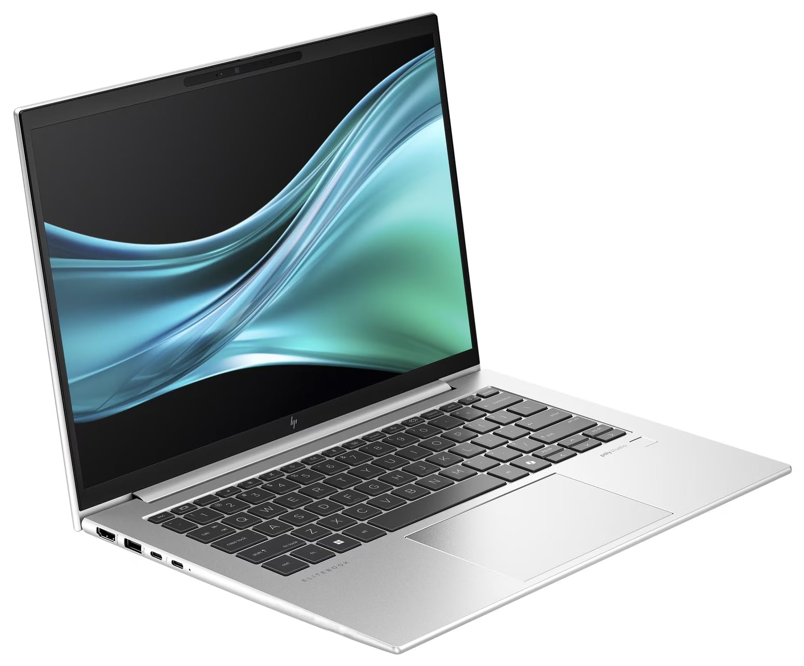
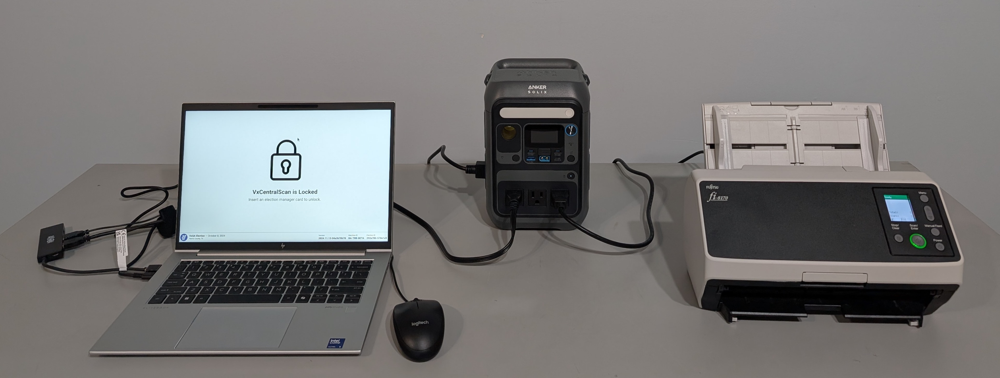
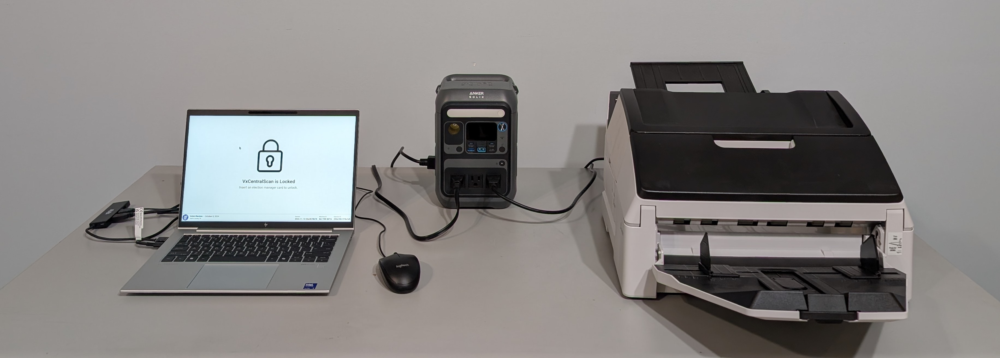

# VxAdmin & VxCentralScan Hardware

## Overview

### &#x20;

### Laptop 

VxAdmin and VxCentralScan are both laptops that connect to peripherals as needed. The laptop is a [custom configured HP Elitebook 840 14" G11](vxadmin-and-vxcentralscan-hardware.md#laptop-specification).

<figure><figcaption>
Laptop keyboard and screen
</figcaption></figure> <figure><figcaption>
Laptop ports
</figcaption></figure>

The relevant hardware interfaces are:

* **Smart Card Reader** - Enables reading and writing to smart cards, which is the basis for authentication in VxSuite
* **USB Ports -** Allows connecting to the peripherals for scanning or printing

While not strictly necessary, VxAdmin and VxCentralScan are bundled with a mouse and a USB hub for ease of use. A USB A-B cable is included to connect to the peripherals.

### VxAdmin

VxAdmin connects to a printer for the purposes of printing reports. The printer includes an RJ45 (ethernet) port which is blocked by a port blocker because network connectivity is not required by the system.&#x20;

<figure><figcaption>
VxAdmin fully connected with mouse, hub, charger, USB cable, and printer
</figcaption></figure>

### VxCentralScan

VxCentralScan connects to a batch scanner for batch scanning. The scanner is either the smaller Ricoh fi-8170 or the larger Ricoh fi-7600. Ballots are loaded into the hopper and then, after a scan is triggered from the application, the scanner processes the ballots one-by-one, sending images to the application for interpretation.

Both batch scanners can be used with Ricoh imprinters (not pictured) which allow printing an identifier on each ballot as it's exiting the scanner, which can be useful for certain types of post-election audits.&#x20;

The batch scanner is powered through an Anker Solix C300 LFS (Lithium Ferrite System) UPS (Uninterruptible Power Supply) to ensure that the scanner can operate in variable power environments.&#x20;

The fi-8170 includes an RJ45 (ethernet) port which is blocked by a port blocker because network connectivity is not required by the system.

<figure><figcaption>
VxCentralScan fully connected with mouse, hub, charger, USB cable, scanner, and power backup
</figcaption></figure>

<figure><figcaption>
VxCentralScan fully connected with mouse, hub, charger, USB cable, scanner, and power backup
</figcaption></figure>

## Bill of Materials

All components for VxAdmin and VxCentralScan are commercial-off-the-shelf (COTS) components. Data sheets and related documentation are available [in the documentation repository](https://github.com/votingworks/docs-vxsuite-v4/tree/main/hardware-assets/cots-documentation/central-system).

### Shared Components (Laptop & Accessories)

<table><thead><tr><th width="152">Manufacturer</th><th width="263">Component</th><th>Mfr. Part Number</th><th>Criticality</th></tr></thead><tbody><tr><td>HP</td><td>Elitebook 840 11" G11 Laptop</td><td>B43P6UP#ABA</td><td>High</td></tr><tr><td>Tripp Lite</td><td>4-Port Ultra-Slim USB Hub</td><td>U360-004-SLIM</td><td>Medium</td></tr><tr><td>Logitech</td><td>B100 Mouse</td><td>910-006061</td><td>Medium</td></tr><tr><td>Monoprice</td><td>USB-A to USB-B 2.0 6ft Cable</td><td>5438</td><td>Medium</td></tr></tbody></table>

### VxAdmin Components (Printer)

<table><thead><tr><th width="152">Manufacturer</th><th width="263">Component</th><th>Mfr. Part Number</th><th>Criticality</th></tr></thead><tbody><tr><td>HP</td><td>LaserJet Pro 4001dn Printer</td><td>2Z600F#BGJ</td><td>Medium</td></tr><tr><td>Lindy</td><td>RJ45 Port Blocker</td><td>40471</td><td>Low</td></tr></tbody></table>

### VxCentralScan Components (Scanner)

VxCentralScan can be used with either the Ricoh fi-8170 or the Ricoh fi-7600, but does not need both. Each scanner can be paired with one of the two imprinters listed below.

<table><thead><tr><th width="155">Manufacturer</th><th width="303">Component</th><th width="176">Mfr. Part Number</th><th>Criticality</th></tr></thead><tbody><tr><td>Ricoh</td><td>fi-8170 Small Desktop Scanner</td><td>PA03810-B055</td><td>High</td></tr><tr><td>Ricoh</td><td>fi-819PRB Imprinter (for fi-8170)</td><td>PA03810-D201</td><td>Medium</td></tr><tr><td>Ricoh</td><td>fi-7600 Large Desktop Scanner</td><td>PA03740-B505</td><td>High</td></tr><tr><td>Ricoh</td><td>fi-760PRB Imprinter (for fi-7600)</td><td>PA03740-D101</td><td>Medium</td></tr><tr><td>Anker</td><td>Solix C300X Portable Power Station</td><td>A1723</td><td>Low</td></tr><tr><td>Lindy</td><td>RJ45 Port Blocker</td><td>40471</td><td>Low</td></tr></tbody></table>

## Laptop Specification

The laptop is a custom configuration of the widely available HP Elitebook 840 14" G11 laptop. B43P6UP#ABA is the HP SKU of the VotingWorks configuration, which includes the following:

| Component                | Configuration                       |
| ------------------------ | ----------------------------------- |
| Processor                | Intel® Core™ Ultra 5 Processor 125U |
| Memory (RAM)             | 8GB (1x8GB) DDR5 5600 SODIMM Memory |
| Storage (SSD)            | 256GB PCIe NVMe Solid State Drive   |
| Display                  | 14"  WUXGA UWVA LED (300 nits)      |
| Battery                  | 56Wh Capacity                       |
| Webcam                   | None                                |
| Near Field Communication | None                                |
| WWAN (Celular)           | None                                |
| WLAN (Wi-Fi)             | None                                |
| Fingerprint Sensor       | None                                |
| Smart Card Reader        | Included                            |
| Country of Origin        | TAA Designated                      |

## Discussion of Critical Components

As listed in the bill of materials above, the high criticality components are as follows:

* **HP Elitebook 840 11" G11** - As the processor and data store for ballot data and other tallies, the laptops are one of the most critical components in the entire system. HP is the only manufacturer. VotingWorks is an official OEM partner of HP in order to work closely together to ensure the quality and configuration of the laptops.
* **Ricoh fi-7600 & fi-8170** - As the source of ballot images for VxCentralScan, the Ricoh scanners are highly sensitive and critical components.

The medium criticality components and the reasons for their classification are as follows:

* **Tripp Lite Ultra Slim USB Hub** - Manages flow of data between laptop and peripherals.
* **Logitech B100 Mouse -** Does not directly handle election data but does plug into a USB port, thus it could still pose a USB attack vector.
* **Monoprice USB A-B Cable -** Manages flow of data between laptop and peripherals.
* **HP LaserJet Pro 4001dn -** The VxAdmin printer is responsible for printing reports from VxAdmin and therefore handles highly sensitive election information. All reports from VxAdmin can be exported as PDFs and printed elsewhere, so it is not strictly necessary for the operation of the system and thus is not the highest criticality.
* **Ricoh fi-760PRB & fi-819PRB** - The imprinters that pair with the Ricoh scanners are not involved in generating ballot data, so they cannot influence the interpretation of ballots when used according to instructions. The imprinted identifiers are important for post-election audits, however, so the imprinters are security-sensitive components.
