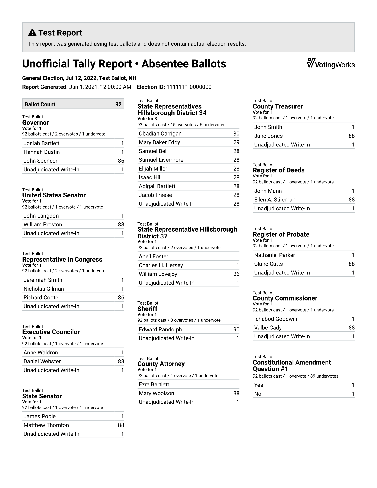
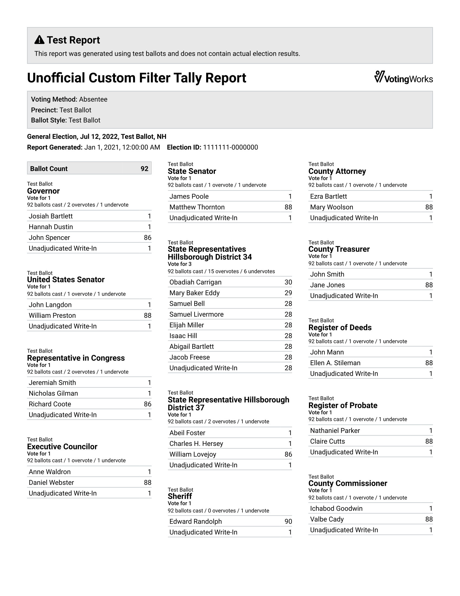
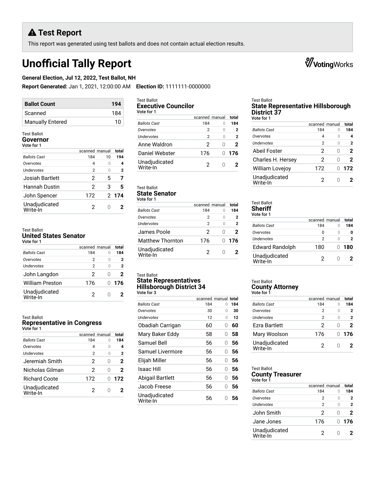
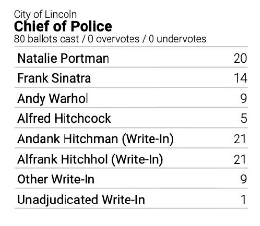

# Tally Reports

## Basic Structure

The basic structure of the tally reports printed from VxAdmin is similar to the [polls opened and closed reports](../vxscan-polls-reports.md) printed from VxScan.

<figure><figcaption>
Full election tally report
</figcaption></figure>

## Filtered and Grouped Reports

In addition to the full election report, VxAdmin exports reports filtered or grouped by the following dimensions:

* Ballot Style
* Precinct
* Voting Method
* Scanner
* Batch
* District (filtering only)

When a report is grouped, the report is broken up into multiple sections each with their own filter. For example, if you were to group by "Voting Method," the resulting report would have a section filtered for precinct ballots only and a section filtered for absentee ballots only:

<figure><figcaption>
First part of a grouped tally report
</figcaption></figure> <figure><figcaption>
Second part of a grouped tally report
</figcaption></figure>

The filter for a given report section is indicated in the title of the report. If the report has more than one filter applied to it, the full details of the filter will be specified in a box below the title:

<figure><figcaption>
Tally report with a complex filter
</figcaption></figure>

Note that filters and groups can be combined.

## Manual Results

If manual results have been added, they will be included in the tally report alongside the scanned results. For each contest, there will be three results columns: "scanned", "manual", and "total".

<figure><figcaption>
Tally report with manual results
</figcaption></figure>

## Write-In Candidate Aggregation

If VxAdmin is in [Qualified Write-In Mode](../vxadmin-function.md#qualified-write-in-mode), all qualified write-ins will be listed regardless of their vote totals. If VxAdmin is in [Open Write-In Mode](../vxadmin-function.md#open-write-in-mode), write-in candidates will only be explicitly listed if they have a winning vote total. Other write-ins are consolidated as "Write-In" or, if there are explicitly listed write-in candidates, "Other Write-In".&#x20;

Unadjudicated write-ins are always consolidated as "Unadjudicated Write-In."

<figure><figcaption>
Before adjudication
</figcaption></figure> <figure><figcaption>
Adjudication just started
</figcaption></figure> <figure><figcaption>
Adjudication almost finished
</figcaption></figure>

