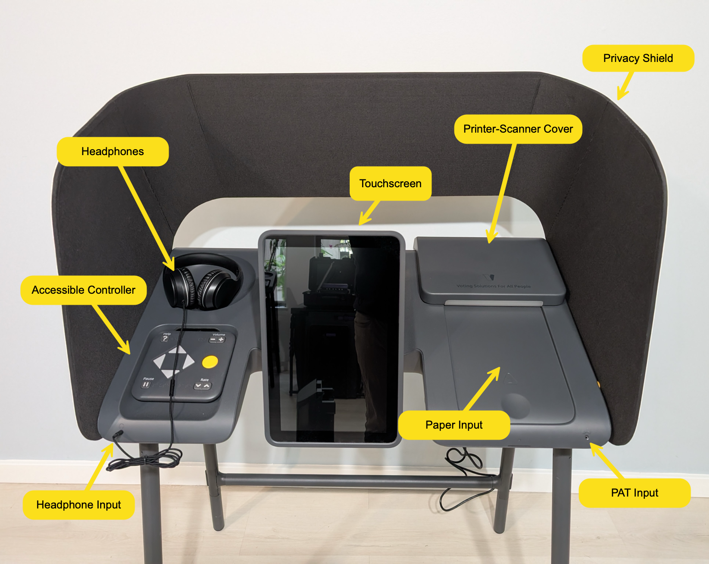
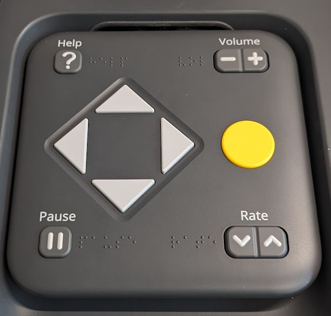
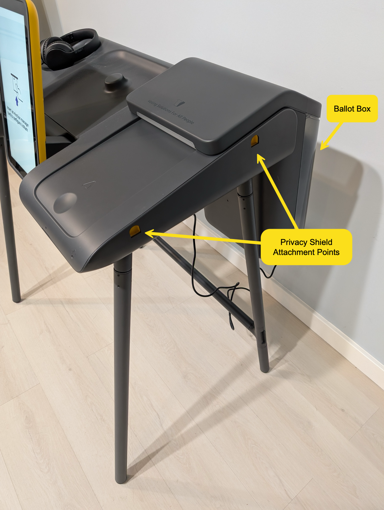
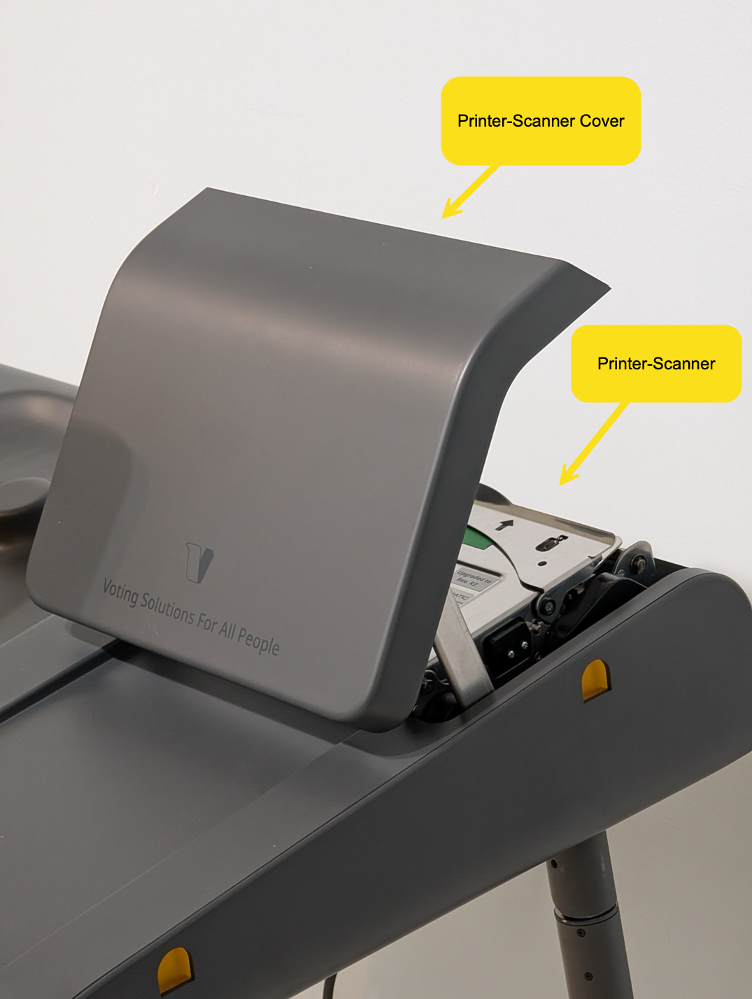
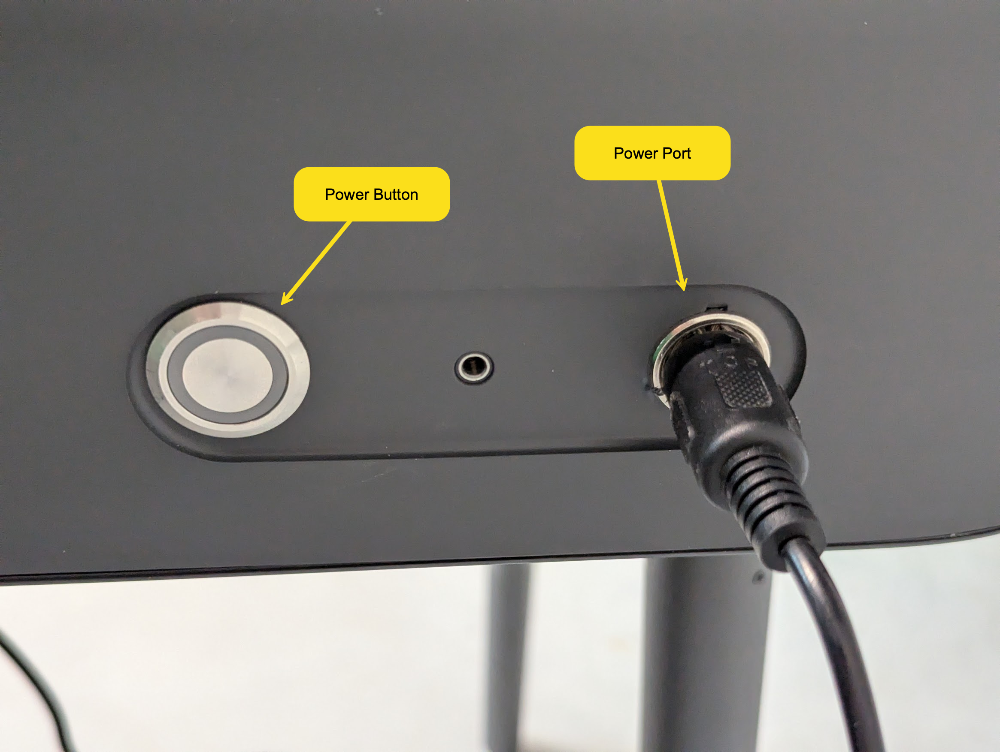
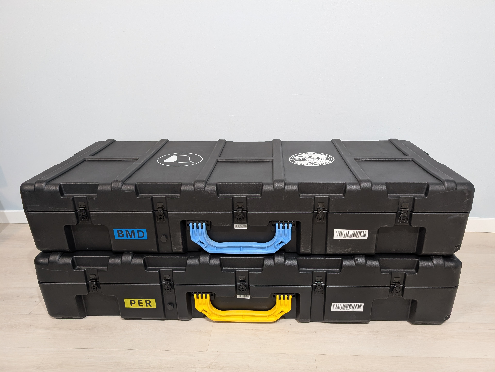
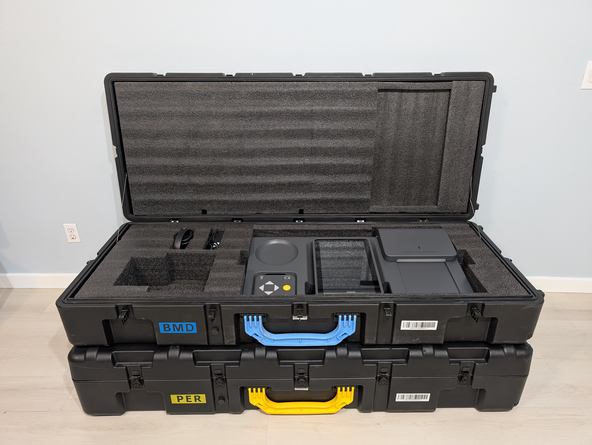
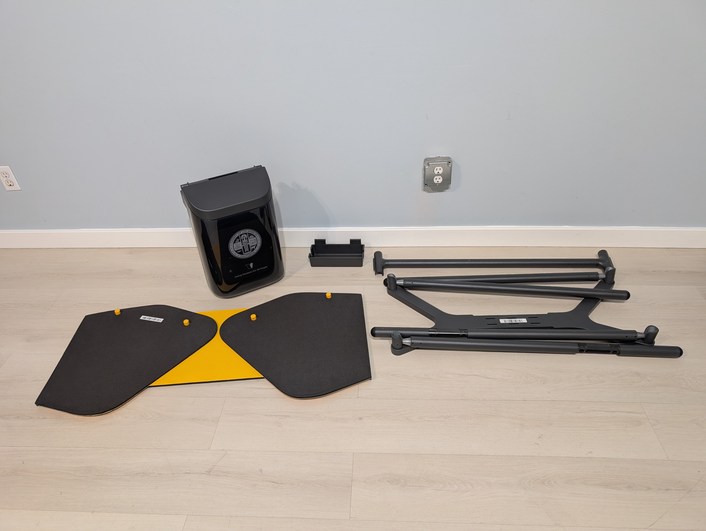
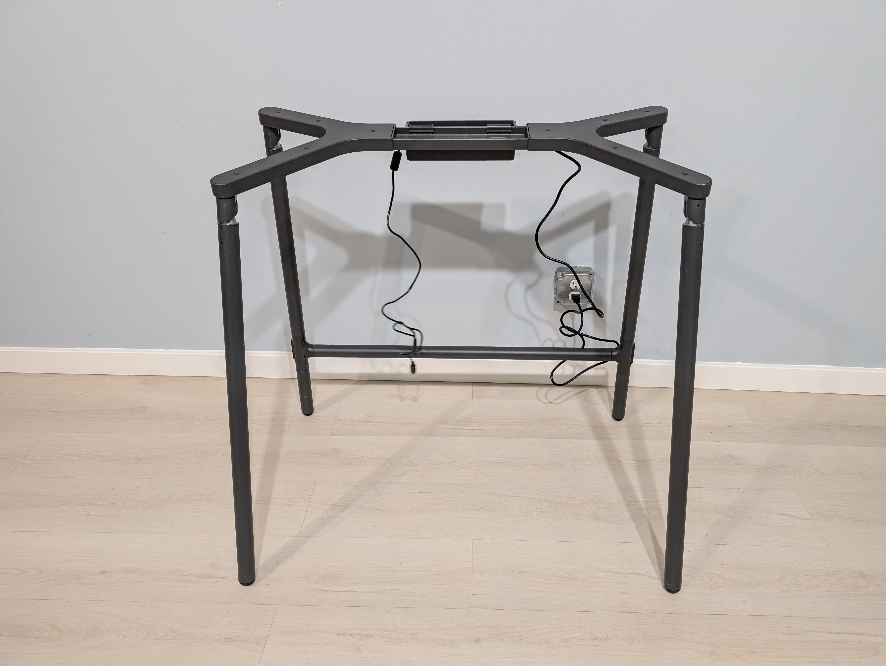
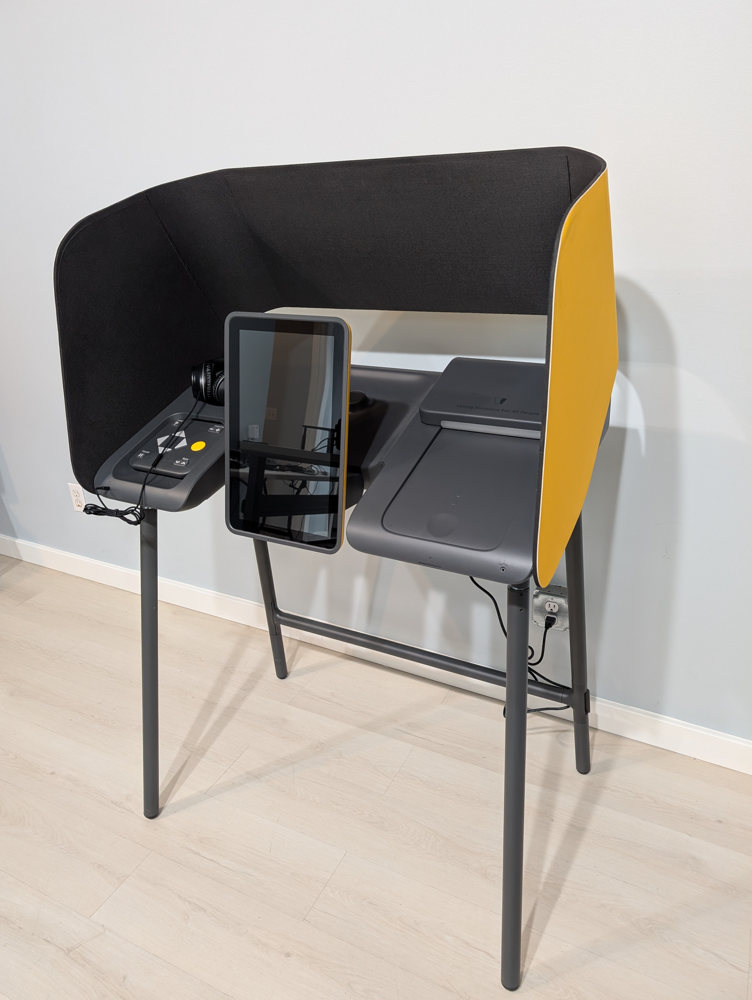

# VxMark Hardware

## Overview

<figure><figcaption></figcaption></figure>

VxMark exposes various hardware interfaces for various modes of voting. The touchscreen displays the ballot and allows making selections with touch. It tilts forward and backwards for easier viewing and for storage. An accessible controller sits on the left side of the screen held in place with light magnetic force. Beneath the accessible controller is the headphone input and above the accessible controller is a recess for resting headphones. On the lower right corner, there is another input jack for a PAT (Personal Assistive Technology) device such as a sip-and-puff.&#x20;

<figure><figcaption>
Accessible Controller
</figcaption></figure>

The right side of the machine is the paper path. Paper is inserted into the printer-scanner by feeding it forward on the front paper input. When the ballot is cast, it is ejected to the rear into the attached ballot box. In case of paper jams, the printer-scanner cover can lift to expose the printer-scanner. If the cover is opened while polls are opened without authentication, an alarm will be triggered through the onboard speaker.

<figure><figcaption></figcaption></figure> <figure><figcaption></figcaption></figure>

The primary modification made by VotingWorks to the original Smartmatic hardware is adding a smart card reader for authentication. The smart card reader is positioned beneath the accessible controller:

<figure><figcaption>
Smart card insert
</figcaption></figure>

Power is controlled by a button in the back left of the machine. When activated, an LED will illuminate the power button. Between the power button and the power port is an additional headphone input which is not used by VxMark.

<figure><figcaption>
Power controls
</figcaption></figure>

VxMark does not require any direct bodily contact or for the body to be part of any electrical circuit to function.

### Storage

VxMark is shipped and stored in large hardshell cases with custom foam cutouts. The first case, accented in blue, is for the BMD itself, its headphones, and its power supply. The second case, accented in yellow, is for the other peripherals - legs, power supply holder, privacy shield, and ballot box.

<figure><figcaption></figcaption></figure> <figure><figcaption></figcaption></figure>

The BMD itself must be padded as shown below for transport and vibrational testing. Padding is used to protect the screen and hold it in place, to hold the accessible controller in place, to hold the printer-scanner cover in place, and to further secure the BMD within the enclosure.

<figure><figcaption>
BMD case fully packed and padded
</figcaption></figure>

<figure><figcaption>
Peripherals case fully packed
</figcaption></figure> <figure><figcaption>
Peripherals case with privacy shield removed
</figcaption></figure> <figure><figcaption>
Peripherals unpacked
</figcaption></figure>

### Assembly

Assembly instructions are covered in the user manual under [VxMark Hardware Setup](https://app.gitbook.com/s/JtZutzGTdCzsGITrdiph/vxmark/vxmark-hardware-setup "mention"). In short, the legs are unfolded and the power block holder is set on the legs with the power block inside. The BMD then fits onto the legs with grooves on its underside.

<figure><figcaption></figcaption></figure> <figure><figcaption></figcaption></figure>

## COTS Components

The vast majority of the VxMark hardware is the [VSAP (Voting Solutions for All People) ](https://www.lavote.gov/vsap/home)Ballot Marking Device (Model 150) developed by Los Angeles County, manufactured by Smartmatic, and purchased through Los Angeles County. In addition, VotingWorks includes a few peripherals or COTS components added through modification. Documentation for these components can be found in [the documentation repository](https://github.com/votingworks/docs-vxsuite-v4/tree/main/hardware-assets/cots-documentation/mark) or in the separately provided Los Angeles County documentation.

<table><thead><tr><th>Manufacturer</th><th width="216">Component</th><th width="175">Mfr. Part Number</th><th>Criticality</th></tr></thead><tbody><tr><td>Smartmatic</td><td>Ballot Marking Device</td><td>VSAP-150</td><td>High</td></tr><tr><td>APC</td><td>Uninterruptible Power Supply</td><td>BN1500M2</td><td>Medium</td></tr><tr><td>HID</td><td>Smart Card Reader</td><td>R31210375-1</td><td>Medium</td></tr><tr><td>LORELEI</td><td>Headphones</td><td>X6</td><td>Low</td></tr><tr><td>Williams Audio Visual</td><td>T-Coil Neckloop</td><td>NKL-001</td><td>Low</td></tr></tbody></table>

## Criticality Discussion

The VSAP system provided by LA County is the primary component and the highest criticality component. The entire system runs on it. The embedded computer and the printer-scanner are both responsible for the printing of ballots and the interpretation of ballots. The various interaction interfaces - touchscreen, accessible controller, and PAT input - can all affect voter selections. VotingWorks and Los Angeles County have a robust partnership that includes the sale of the hardware itself, documentation transfer, and alignment on access control and quality assurance procedures.

The only other critical component, with medium criticality, is the HID smart card reader. As it is responsible for communicating with smart cards and facilitating authentication, it is a sensitive component.
