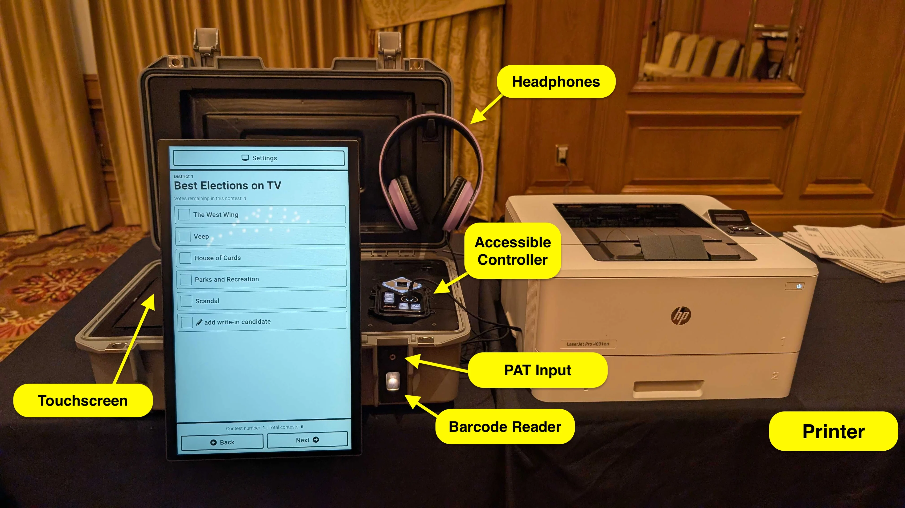
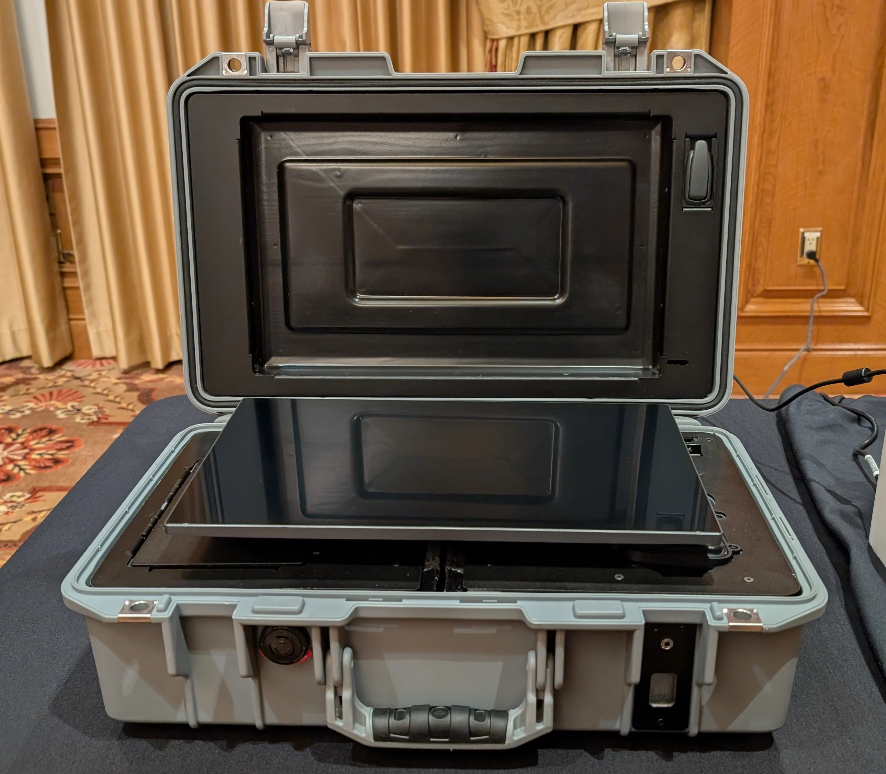
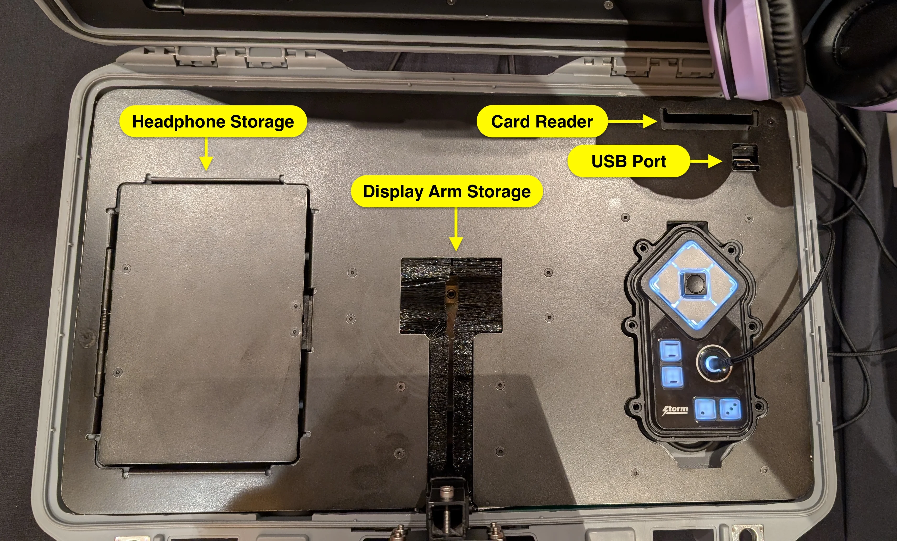
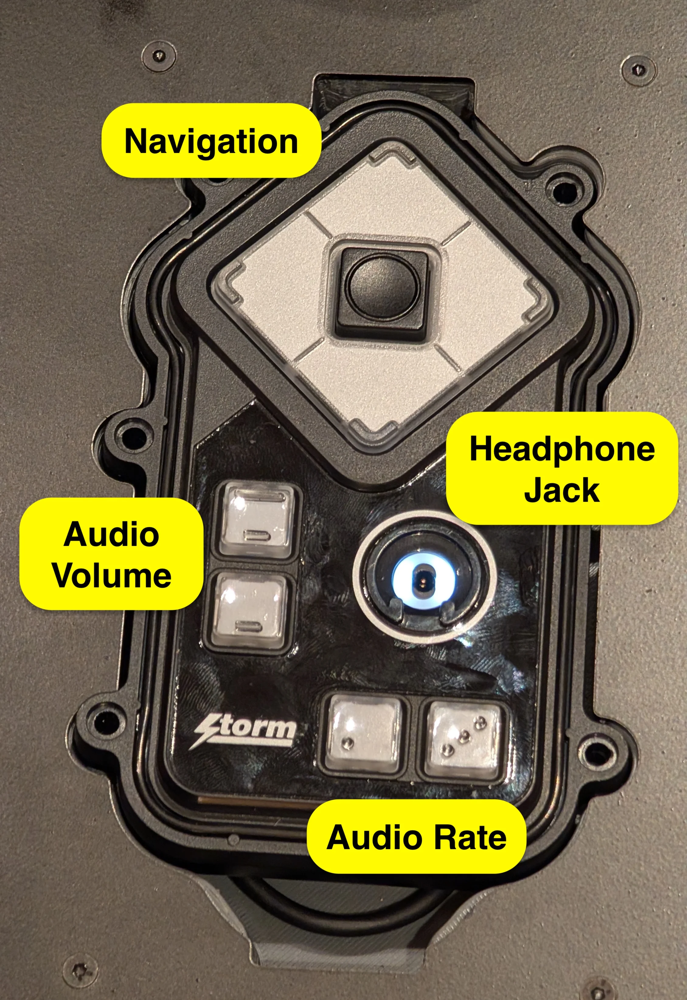
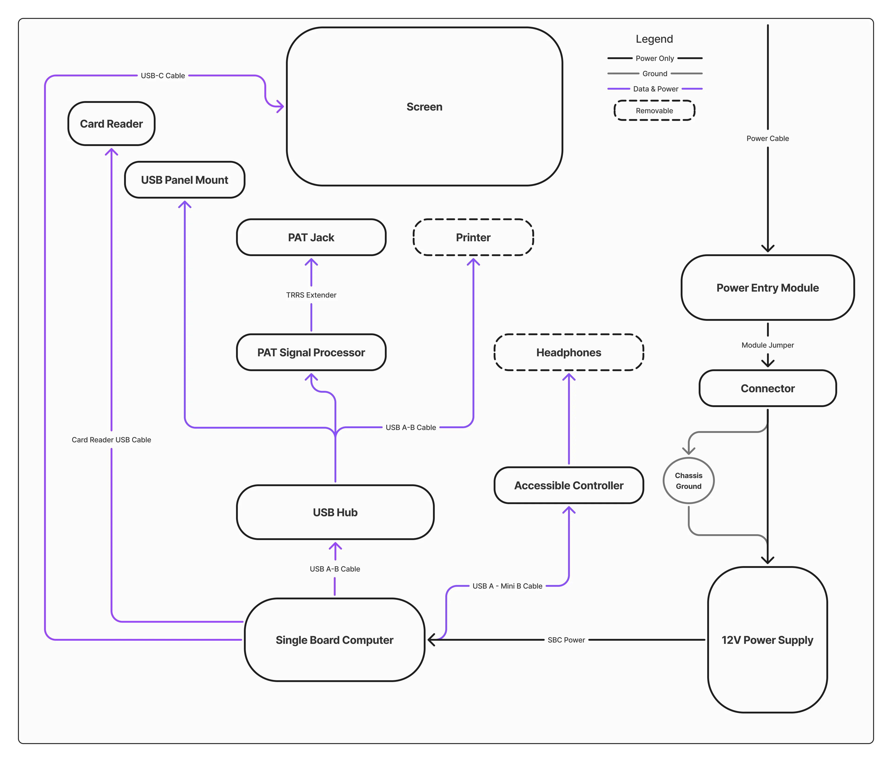

# VxMark Hardware

## Overview

VxMark consists of two main components - the tabletop ballot marking device and the attached printer - which are connected together during setup.

<figure><figcaption></figcaption></figure>

### Ballot Marking Device

The tabletop ballot marking device is built into a customized Pelican 1485 Air case. The COTS case features:

* Seal Points
* Carrying Handle
* Spring-Loaded Latches

Additional cuts are made into the case for the nameplate attachment, PAT input jack, barcode reader, and the spring-loaded back compartment which houses the USB and AC power cables.

<figure><figcaption>
VxMark Unit
</figcaption></figure>

The case is opened by pressing the buttons on each case latch and then lifting the lid. In the picture below you can see the card reader, USB port, headphone storage, and display arm storage.  The ATI handset is located in front of the USB port.

<figure><figcaption>
VxMark Overhead View
</figcaption></figure>

### Printer

The printer is the [HP LaserJet Pro 4001dn](https://github.com/votingworks/docs-vxsuite-v4/blob/c3708afd846808afb7249ef1c11d099a86d1e15a/hardware-assets/cots-documentation/mark/HP-LaserJet-Pro-4001dn-Datasheet.pdf), which prints double-sided black-and-white pages up to legal length (14"). The printer connects to VxMark via the USB cable in VxMark's back compartment. VxMark is compatible with a variety of other HP printers and extensions:

* Extended Input Tray - If a jurisdiction wishes to print on ballots longer than 14", we can provide a custom printer tray supporting up to 22" ballots.
* High Volume Input Tray - A larger input tray is available for jurisdictions where every voter users VxMark.

### Display

The display is a 15" HD (1920 x 1080) touchscreen, specifically the [Elo 1504LS](https://github.com/votingworks/docs-vxsuite-v4/blob/c3708afd846808afb7249ef1c11d099a86d1e15a/hardware-assets/cots-documentation/mark/Elo-1504LS-Touchscreen-Datasheet.pdf). It can be tilted forward or backward by a voter based on their preferences. The screen includes an embedded speaker which is used for machine chimes and alerts. The screen rotates horizontally and then tips all the way back into the case for storage.

<figure><figcaption>
VxMark Display
</figcaption></figure>

### Accessible Controller & Headphones

The accessible controller sits to the right of the display, either in its cradle or beside VxMark outside of its case. It is the commercially available [Storm AudioNav 9-Key Keypad](https://github.com/votingworks/docs-vxsuite-v4/blob/c3708afd846808afb7249ef1c11d099a86d1e15a/hardware-assets/cots-documentation/mark/Storm-Interfaces-AudioNav-EF-Datasheet.pdf). Four keys navigate directionally (up, down, left, right), one key is used to make selections, a pair of keys are used to control audio volume, and another pair of keys are used to control audio playback speed.

<figure><figcaption>
VxMark Accessible Controller
</figcaption></figure>

The headphones plug directly into the 3.5mm audio jack on the accessible controller. Any standard headphones can be used if a voter prefers, but note that the default volume levels were calibrated for the headphones that were provided with VxMark. Voting session audio plays through the headphones and only through the headphones. The volume and rate adjustments will have no impact on system sounds played over the speakers.

### PAT Input

The PAT input is on the front of the case to the right of the screen. It is compatible with any PAT (Personal Assistive Technology) device such as a sip-and-puff.

### Barcode Scanner

The barcode scanner, the Honeywell [CM4680-SR](https://github.com/votingworks/docs-vxsuite-v4/blob/c3708afd846808afb7249ef1c11d099a86d1e15a/hardware-assets/cots-documentation/mark/Honeywell-CM4680-SR-BarcodeReader-Datasheet.pdf), allows voters to activate their own ballot styles if provided the proper barcode by the jurisdiction, typically through an electronic poll book.&#x20;

<figure><figcaption></figcaption></figure>

## Electronic Subcomponents

The various components of the ballot marking device are arranged and wired together within the Pelican case. Custom cut holes in the Pelican case allow mounting brackets in the top and bottom tubs which are then used to attach components.

Power enters through a power module located within the back compartment of the case where the power and data cables are located. The power module connects to a 12-volt power supply which supplies power to all components within the device.

All USB cables ultimately connect to the single board computer. The card reader, and accessible controller connect directly to the single board computer via USB cable. The USB hub which supplies power and data connections to the USB panel, PAT signal processor (PAT input jack), and printer, is connected directly to the computer. Finally, a USB-C cable connects the computer to the screen. The USB-C cable carries video, audio, touch input, and power.&#x20;

Audio is provided to the headphones via a 3.5 mm jack located on the Accessible Controller. A 3.5 mm panel-mount jack, on the front right of the unit, provides a personal assistive technology (PAT) input. This PAT jack is internally wired to a programmable switch interface connected to the USB hub. This device converts dual-switch input events into keyboard commands recognized by the software.&#x20;

The wiring diagram below outlines the power and data connections within the ballot marking device. Black lines indicate power connections, gray lines indicate ground connections, and purple lines indicate data connections, which may also carry low voltage power.

VxMark does not require any direct bodily contact or for the body to be part of any electrical circuit to function.

<figure><figcaption>
VxMark Wiring Diagram
</figcaption></figure>

## COTS Components

VxMark includes many COTS components, which mostly fall into two categories. First, many small pieces of hardware such as fasteners are purchased commercially. These are called out in the bill of materials and are not generally critical components. Second, most of the electronic components are purchased commercially. Documentation for these components can be found in [the documentation repository](https://github.com/votingworks/docs-vxsuite-v4/tree/main/hardware-assets/cots-documentation/mark).

<table><thead><tr><th width="209.84735107421875">Manufacturer</th><th width="247.2144775390625">Component</th><th width="200.09564208984375">Mfr. Part Number</th><th>Criticality</th></tr></thead><tbody><tr><td>Aaeon</td><td>Single-Board Computer</td><td>UPN-ADLN97-A10-0864</td><td>High</td></tr><tr><td>ADATA</td><td>Solid-State Drive</td><td>IM2P32A8-128GCTB5</td><td>High</td></tr><tr><td>ELO Touch</td><td>Touchscreen</td><td>1504LS</td><td>High</td></tr><tr><td>HP</td><td>LaserJet Printer</td><td>LaserJet Pro 4100dn</td><td>High</td></tr><tr><td>MEAN WELL</td><td>12V Power Supply</td><td>LRS-75-12</td><td>Medium</td></tr><tr><td>HID Omnikey</td><td>Embedded Smart Card Reader</td><td>R31210375-1</td><td>Medium</td></tr><tr><td>Coolgear</td><td>USB Hub</td><td>CG-3510S4-BOARD</td><td>Medium</td></tr><tr><td>Pi Engineering</td><td>Programmable Switch Interface</td><td>XK-1283-UJS3-R</td><td>Medium</td></tr><tr><td>Honeywell</td><td>Barcode Scanner</td><td>CM4680SR-BW0</td><td>Medium</td></tr><tr><td>Storm-Interface</td><td>Accessible Controller</td><td>1409-34011</td><td>Medium</td></tr><tr><td>Pelican</td><td>Outer Case</td><td>Pelican Air 1485</td><td>Medium</td></tr><tr><td>HP</td><td>Printer Toner for HP4001dn</td><td>HP 148A or 148X</td><td>Medium</td></tr><tr><td>Custom</td><td>SBC Power Cable</td><td>N/A</td><td>Low</td></tr><tr><td>CUI Devices</td><td>Power Cable</td><td>AC-C13 NA</td><td>Low</td></tr><tr><td>ELO Touch</td><td>ELO Display Cable</td><td>1504LS-USBC-DISPLAY-CABLE</td><td>Low</td></tr><tr><td>Headphones</td><td>Lorelei</td><td>X8 Over-Ear Wired</td><td>Low</td></tr><tr><td>McMaster Carr</td><td>USB 2.0 Cable, A to Micro-B Plug, 3 Ft</td><td>4974T171</td><td>Low</td></tr><tr><td>MY-CABLE-MART</td><td>3.5mm Male to Female Panel-Mount Extension Cable, 1.5 Ft</td><td>FE-3MMPM-01MF</td><td>Low</td></tr><tr><td>STARTECH</td><td>USB Cable 2.0, A to Left Angle Mini-B, 3 Ft</td><td>USB2HABM3LA</td><td>Low</td></tr><tr><td>Tripp-Lite</td><td>Tripp-Lite Panel Mount USB Connector</td><td>U324-001-APM</td><td>Low</td></tr><tr><td>Tripp-Lite</td><td>USB 2.0 Cable, A Plug to B Plug, 6 Ft</td><td>U023-006</td><td>Low</td></tr><tr><td>USB-FIREWIRE</td><td>Coiled Cable, USB 2.0, Right Angle A to Right Angle Mini-B, 17-36 In</td><td>RR-AR4MBR1-24GLHC</td><td>Low</td></tr><tr><td>USB-FIREWIRE</td><td>USB 3.0 Cable, Down Angle B to Right Angle A, 16 In</td><td>RR-ARBD-16GRX</td><td>Low</td></tr><tr><td>AbleNet</td><td>PAT Device: Jelly Bean Switches</td><td>10033400</td><td>Low</td></tr><tr><td>RF Adapter Store</td><td>PAT Device: Y-Splitter</td><td>RFA0740</td><td>Low</td></tr><tr><td>GoldenMate</td><td>Uninterruptible Power Supply</td><td>UPS 1500VA/1000W</td><td>Low</td></tr><tr><td>Williams Audio Visual</td><td>T-Coil Neckloop</td><td>NKL-001</td><td>Low</td></tr></tbody></table>

The specified neckloop achieves a T4 rating when used with assistive hearing devices that include T4 rated telecoils.

## Discussion of Critical Components

As listed in the COTS table above, the high criticality components are as follows:

* **Aaeon UP Squared Pro 7000 Computer** - As the computer which facilitate accessible ballot marking, ballot review, and ballot printing, the single board computer is a highly critical component. VotingWorks partners with Aaeon, Inc. and their production in Taiwan to ensure the trustworthy production and quality of each single board computer.
* **Solid State Drive -** The solid state drive is the storage medium for all sensitive election data.&#x20;
* **HP LaserJet Pro 4001dn Printer -** The HP LaserJet Printer is the means for printing ballots and reports.&#x20;
* **ELO Touch 15" LCD Touchscreen -** The Elo touchscreen is responsible for rendering election data and correctly handling user touches. It is a custom component from a single manufacturer and therefore has high criticality.

The medium criticality components and the reasons for their classification are as follows:

* **USB Cables, Hub, and Switch -** USB cables connect to the computer and carry sensitive election data, so they are medium criticality. The attack vectors are difficult, however, and all cables can be produced by alternate manufacturers.
* **Power Cables & Power Supplies** - Power supplies and cables can affect the reliability of the equipment in initially difficult to detect ways, and are thus medium criticality, but they generally cannot corrupt election data in a targeted or undetectable way.
* **Barcode Reader** - The barcode reader is included for features that will be implemented in the future such as ballot activation by barcode.  Since the barcode reader can be used to print a ballot which is a security concern, the barcode reader and its supplier are considered critical.
* **Pelican Case** - The Pelican case cannot meaningfully affect the operation of the software, but its sole supplier is Pelican. Since the equipment is designed around the particular case, the case and its supplier are considered critical.&#x20;
* **Smart Card Reader -** The smart card reader is responsible for communicating with smart cards to manage authentication, and is thus a critical component.
* **Audio Tactile Controller & Headphones -** These components are required for use of the VxMark audio-tactile voting interface.
