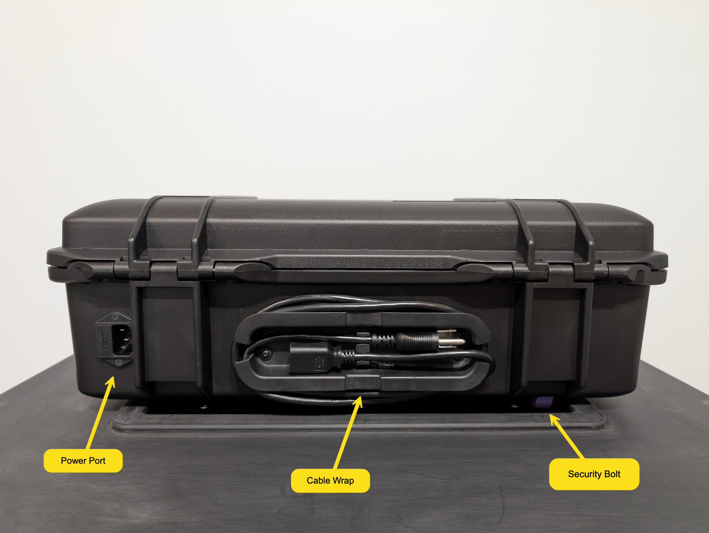
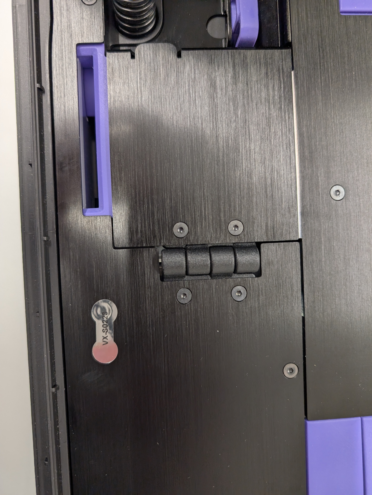
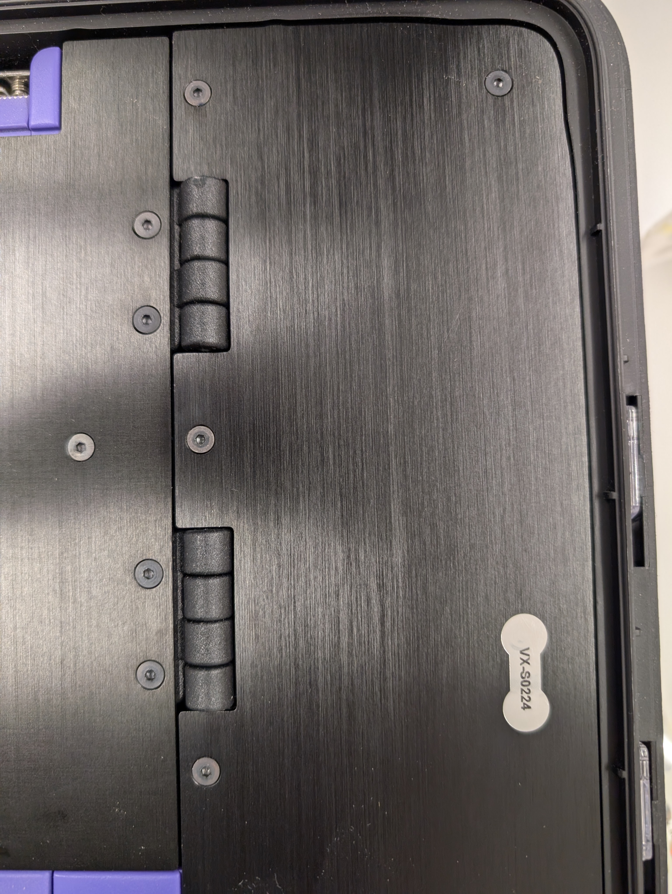
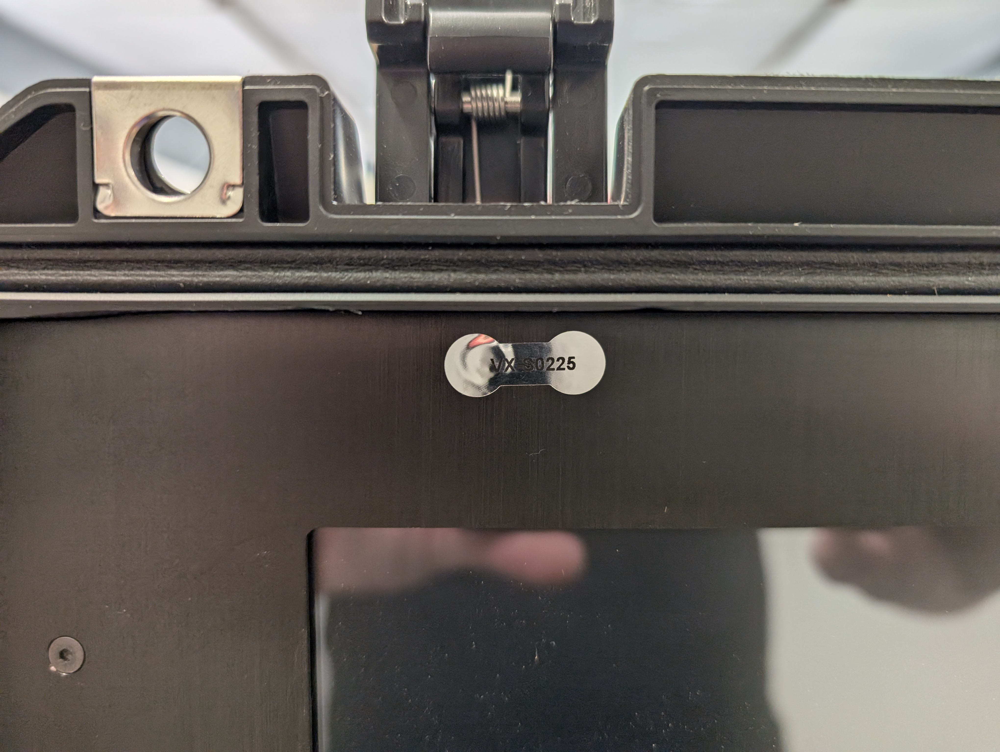
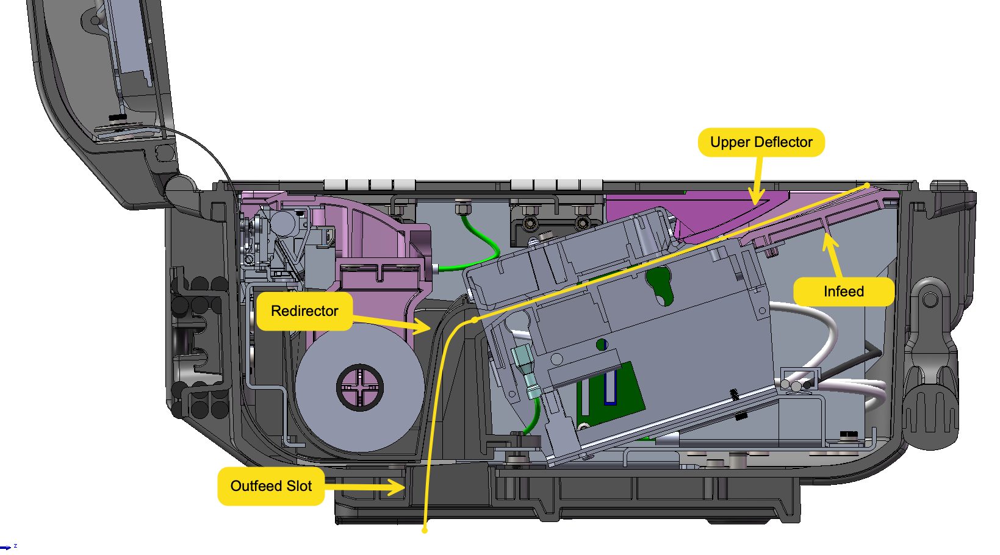

# VxScan Hardware

## Functional Overview

VxScan consists of two main components - the collapsible ballot box and the scanner itself - which are secured together during setup.

<figure><figcaption></figcaption></figure>

### Ballot Box

<figure><figcaption>
Ballot box front, collapsed
</figcaption></figure>

 

<figure><figcaption>
Ballot box side, collapsed
</figcaption></figure>

 

<figure><figcaption>
Ballot box lid underside, collapsed
</figcaption></figure>

The ballot box features a telescoping handle and wheels for ease of transport. When collapsed, closing straps run around the side of the box to hold it closed. Before the ballot box is set up, the closing straps are loosened and secured to the underside of the ballot box lid. &#x20;

The front of the ballot box is the ballot door, which is used to access the bin interior and any ballots within. It's opened by pulling the ballot door latch pictured above, which automatically latches whenever the door is closed. A seal can be installed to prevent the door from being opened without tamper-evidence.

The ballot door has a built-in auxiliary bin for depositing ballots in situations where the cannot be scanned. It can be in one of three states: closed, open slightly for depositing ballots, or open fully for removing ballots. It's opened by pressing down on the indicated handle which can be sealed with the adjacent seal point.

After closing straps are loosened, the ballot box can be expanded. An accented foot hook can be used as an aid in expanding the box. Once the box is fully expanded, the lid can be rotated up and over to eventually latch into place.

<figure><figcaption>
Ballot box side, open
</figcaption></figure>

 

<figure><figcaption>
Ballot box interior
</figcaption></figure>

 

<figure><figcaption>
Ballot box side, closed
</figcaption></figure>

The ballot box lid can be released by pushing the ballot box lid handle, indicated below. The handle is covered by the scanner when installed, so it cannot be opened while the scanner is in operation and sealed in place. The box lid has a ballot slot which mates with the scanner's ballot outfeed.&#x20;

The scanner attaches to the ballot box by sliding into the area in the front of the lid. Flanges on the bottom of the scanner prevent it from moving up and down or side to side. To secure the scanner front to back and lock it into place, the scanner has a security bolt which mates with the security bolt hole on the top of the ballot box. After the security bolt is engaged, the scanner cannot be removed until the security bolt is unsealed and released.

<figure><figcaption>
Ballot box from above, closed
</figcaption></figure>

### Scanner

The scanner is built into a customized Pelican 1485 Air case. The COTS case features:

* Seal Points
* Carrying Handle
* Spring-Loaded Latches

Additional cuts are made into the case for the back power port, the back cable wrap, the security bolt exit, nameplate attachment, and mounting features within the case.

<figure><figcaption>
Ballot box with scanner installed
</figcaption></figure>

 

<figure><figcaption>
Scanner rear
</figcaption></figure>

The case is opened by pressing the button on the case latch and lifting the lid. The elements that a voter or poll worker interact with are generally accented in purple, just as with the ballot box. In the picture below you can see the smart card insert, security bolt, ballot infeed, and printer outfeed all accented in purple.

<figure><figcaption>
Scanner main bottom tub
</figcaption></figure>

 

<figure><figcaption>
Scanner upper tub 
</figcaption></figure>

Then the scanner is first installed on the ballot box, the security bolt will be disengaged. While the security bolt is disengaged, the smart card slot will be blocked. The user must push the bolt down to lock the scanner into place on the ballot box and unblock the smart card slot. When the scanner must be removed from the ballot box, the user pulls the security bolt release to disengage the security bolt. In order to access the security bolt release, the poll worker door must be opened, which also reveals the scanner's USB ports. The poll worker door can be sealed shut by passing a seal through a cutout in the door and the hold in the top of the security bolt.

<figure><figcaption>
Poll worker door area
</figcaption></figure>

 

<figure><figcaption>
Poll worker door sealed
</figcaption></figure>

Poll workers will normally not have to interface with any parts of the scanner that have not already been described, but election managers will have to open the access door to perform maintenance on the printer and scanner. The access door is held in place by the poll worker door and can only be opened when the poll worker door is unsealed and opened. The printer and printer roll holder are beneath the access door toward the screen. The user presses the green release lever to remove the printer roll holder and install a paper roll. The scanner can be opened simply by lifting the scanner cover handle, revealing the scanner glass for easy cleaning.

<figure><figcaption>
Access door area
</figcaption></figure>

 

<figure><figcaption>
Scanner features
</figcaption></figure>

## Scanner Internals

The various components of the scanner are arranged and wired together within the Pelican case. Custom cut holes in the Pelican case allow mounting brackets in the top and bottom tubs which are then used to attach components.

Power enters through a power module embedded in the case. The power module connects to a 24-volt power supply which supplies the scanner and printer with power. A 12-volt power supply is daisy-chained from the 24-volt power supply in order to power the single board computer.&#x20;

The metal chassis of the bottom tub is grounded to exterior ground via the power module. Everything else requiring grounding is then grounded to the bottom chassis - power supply, lid chassis, access panel, and the scanner.

All USB cables ultimately connect to the single board computer. The card reader and printer connect via a custom USB cable directly to headers on the computer. The USB hub, which then connects to the USB ports and scanner, is connected directly to the computer. Finally, a USB-C cable connects the computer to the screen. The USB-C cable carries video, audio, touch input, and power. Audio is carried through the screen to the speakers via a separate cable.

The wiring digram below outlines the power and data connections within the scanner. Black lines indicate power connections, gray lines indicate ground connections, and purple lines indicate data connections, which may also carry low voltage power.

<figure><figcaption>
VxScan Wiring Diagram
</figcaption></figure>

<figure><figcaption>
Wiring components
</figcaption></figure>

 

<figure><figcaption>
Voltage warning over power supplies
</figcaption></figure>

To prevent access to internals, VotingWorks installs three seals over screws holding the metal panels in place - one on the bottom left panel covering the computer, one on the bottom right panel covering the power supplies, and one on the top panel holding the display in place. These seals are installed at the factory and are intended to be permanent aside from when panels need to be opened for repairs.

<figure><figcaption>
Bottom left panel seal
</figcaption></figure>

 

<figure><figcaption>
Bottom right panel seal
</figcaption></figure>

 

<figure><figcaption>
Top panel seal
</figcaption></figure>

### Paper Path

<figure><figcaption></figcaption></figure>

The paper path is carefully designed and tested to ensure a smooth and uninterrupted ballot scan and deposit. The voter inserts paper over the infeed which mates directly with the scanner.  The scanner lid handle doubles as an upper deflector, deflecting ballots which are inserted too high by the voter. As the ballot passes through the scanner, it hits the ballot redirector behind the scanner. The ballot redirector is a logarithmic curve which ensures that wherever the ballot strikes, it will be directed downward. The ballot then passes through the outfeed slot (which is only open when the scanner case is open) into the ballot box.

## COTS Components

VxScan includes many COTS components, which mostly fall into two categories. First, many small pieces of hardware such as fasteners are purchased commercially. These are called out in the bill of materials and are not generally critical components. Second, most of the electronic components are purchased commercially. Documentation for these components can be found in [the documentation repository](https://github.com/votingworks/vxsuite-v4-documentation/tree/main/hardware-assets/cots-documentation/scan).&#x20;

<table><thead><tr><th width="176">Manufacturer</th><th width="225">Component</th><th width="197">Mfr. Part Number</th><th>Criticality</th></tr></thead><tbody><tr><td>Peripheral Dynamics, Inc.</td><td>PageScan 6 Scanner</td><td>PS6</td><td>High</td></tr><tr><td>USBFirewire</td><td>10" USB A-B Cable</td><td>RR-ADBU-10GR</td><td>Medium</td></tr><tr><td>L-com</td><td>0.5m USB A-B Cable</td><td>CAABLK-90RB-05M</td><td>Medium</td></tr><tr><td>GlobTek, Inc.</td><td>USB-C Cable</td><td>USBCW1M0USBC2SLEMBK</td><td>Medium</td></tr><tr><td>HID Omnikey</td><td>Embedded Smart Card Reader</td><td>R31210375-1</td><td>Medium</td></tr><tr><td>Aaeon</td><td>Single-Board Computer</td><td>UPN-ADLN97-A10-0864</td><td>High</td></tr><tr><td>ADATA</td><td>Solid-State Drive</td><td>IM2P32A8-128GCTB5</td><td>High</td></tr><tr><td>Tripp Lite</td><td>USB Panel Mount</td><td>U324-001-APM</td><td>Medium</td></tr><tr><td>CUI Devices</td><td>Power Cable</td><td>AC-C13 NA</td><td>Low</td></tr><tr><td>MEAN WELL</td><td>12V Power Supply</td><td>LRS-75-12</td><td>Medium</td></tr><tr><td>MEAN WELL</td><td>24V Power Supply</td><td>LRS-150-24</td><td>Medium</td></tr><tr><td>Fujitsu</td><td>A4 Thermal Printer Mechanism</td><td>FTP-68EMCL112-R</td><td>High</td></tr><tr><td>Fujitsu</td><td>A4 Thermal Printer Control Board</td><td>FTP-62EDSL201-R</td><td>High</td></tr><tr><td>Fujitsu</td><td>A4 Thermal Printer Head Cable</td><td>FTP-62EY001-R</td><td>Medium</td></tr><tr><td>Coolgear</td><td>USB Hub</td><td>CG-3510S4-BOARD</td><td>Medium</td></tr><tr><td>Pelican</td><td>Outer Case</td><td>Pelican Air 1485</td><td>Medium</td></tr><tr><td>Elo</td><td>Touchscreen</td><td>E976783</td><td>Medium</td></tr></tbody></table>

## Discussion of Critical Components

As listed in the COTS table above, the high criticality components are as follows:

* **Aaeon UP Squared Pro 7000 Computer** - As the computer which orchestrates ballot interpretation and vote tallying, the single board computer is a highly critical component. VotingWorks partners with Aaeon, Inc. and their production in Taiwan to ensure the trustworthy production and quality of each single board computer.
* **PageScan 6 Scanner** - As the source of ballot images for interpretation, the embedded scanner is a highly critical component. Any interference in image creation could affect interpretation and subsequently vote tallies. Any interference in paper handling could affect ballot accounting. VotingWorks works closely with Peripheral Dynamics, Inc. to ensure the quality of the hardware and firmware of the scanner manufactured domestically. The specific VotingWorks firmware version is tracked by Peripheral Dynamics, Inc. and installed on all scanners.&#x20;
* **Fujitsu Thermal Printer Mechanism and Control Board -** The thermal printer is a less sensitive component than the previous two because it does not send sensitive data to the application - it only receives sensitive data. It is still a single-sourced component with complex subassemblies, however, and any issues printing would prevent jurisdictions from having accurate day-end results.
* **Solid State Drive -** The solid state drive is the storage medium for all sensitive election data.

The medium criticality components and the reasons for their classification are as follows:

* **USB Cables, Hub, and Mounts -** USB cables connect to the computer and carry sensitive election data, so they are medium criticality. The attack vectors are difficult, however, and all cables can be produced by alternate manufacturers.
* **Power Cables & Power Supplies** - Power supplies and cables can affect the reliability of the equipment in initially difficult to detect ways, and are thus medium criticality, but they generally cannot corrupt election data in a targeted or undetectable way.
* **Pelican Case** - The Pelican case cannot meaningfully affect the operation of the software, but its sole supplier is Pelican. Since the equipment is designed around the particular case, the case and its supplier are considered critical.&#x20;
* **Touchscreen -** The Elo touchscreen is responsible for rendering election data and correctly handling user touches, but it generally cannot impact election data and impacts would be perceptible. It is custom component from a single manufacturer, however, and is certainly medium criticality.
