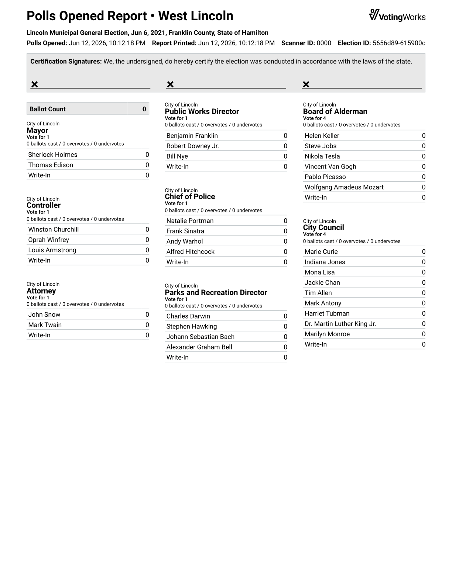
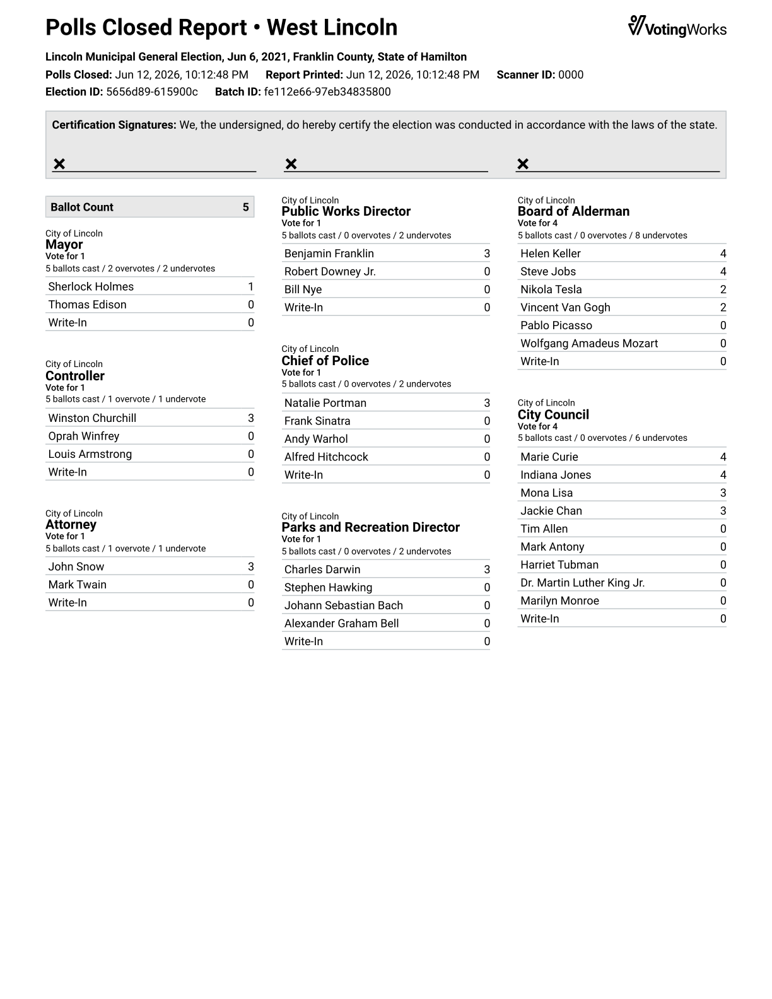
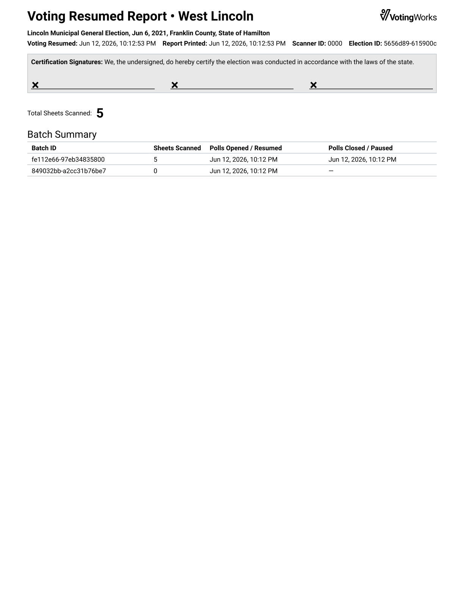
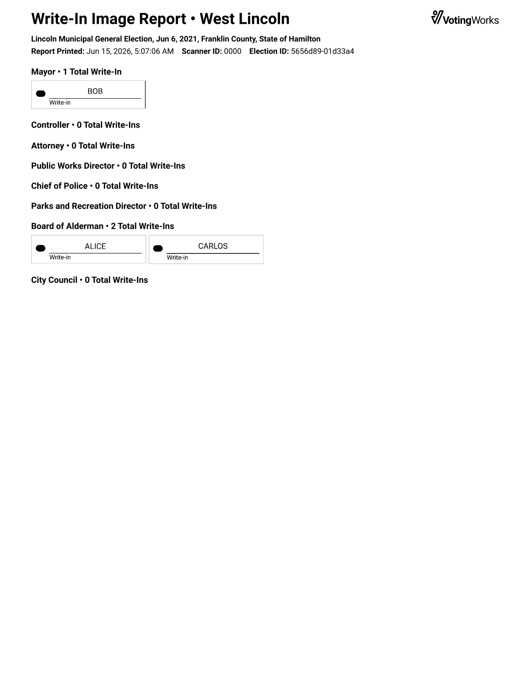

---
layout:
  width: default
  title:
    visible: true
  description:
    visible: false
  tableOfContents:
    visible: true
  outline:
    visible: true
  pagination:
    visible: true
  metadata:
    visible: true
  tags:
    visible: true
  actions:
    visible: true
---

# VxScan Reports

## Polls Opened and Closed Reports

When polls open or close on VxScan, a tally report is printed. The tally report contains the tally results (pre-adjudication) of all ballots scanned at the scanner.

The tally report header contains the following information:

* **Title** - Includes the type of the polls report and the name of the polling place
* **Subtitle** - For primary elections, includes the full party name or "Nonpartisan Contests"
* **Election Info** - The title, date, and location of the election
* **Timestamps** - The first timestamp indicates when the poll status changed and the second indicates when the report was printed. In most cases these times are the same, but in some cases the report may be printed later.
* **Election ID** - The election ID on the report is a concatenation of the ballot hash and election hash and specifies exactly which election definition and election settings that the report corresponds to
* **Certification Signatures** - The space is provided for poll workers or election officials to sign the report in accordance with local statute.

For elections with multi-sheet ballots, counts per sheet are displayed in addition to the overall ballot count.

Each candidate or contest option appears in a row below the contest header. Because results at VxScan are not yet adjudicated, all write-ins are grouped under the "Write-In" bucket (except unmarked write-ins, which are reported as undervotes until adjudicated at VxAdmin).

As a rule, the sum of the number of votes for all candidates, the number of undervotes, and the number of overvotes will equal the number of total possible votes for the contest, which is the number of ballots times the number of selections allowed.

<pre><code><strong>candidate votes + undervotes + overvotes = ballots * votes allowed
</strong></code></pre>

<figure><figcaption></figcaption></figure> <figure><figcaption></figcaption></figure>

If there were multiple batches, which on VxScan is a result of pausing and resuming voting, the polls closed report will contain a "Batch Summary" table with the sizes and timestamps of the batches.

## Voting Paused and Resumed Reports

When voting is paused, VxScan prints a voting paused report containing the total ballot count and ballot count of the most recent batch. When voting is resumed, VxScan prints a voting resumed report containing the total ballot count. The full batch history is included in the "Batch Summary" table.

Tally results are never included in polls paused or resumed reports.

<figure><figcaption></figcaption></figure> <figure><figcaption></figcaption></figure>

## Write-In Image Reports

If `precinctScanEnableWriteInImageReport` is true in the system settings, poll workers will be able to print write-in image reports from the poll worker menu after polls are closed. For each contest that allows write-ins, the report lists the total number of write-ins and includes an image of each write-in.

<figure><figcaption></figcaption></figure>
