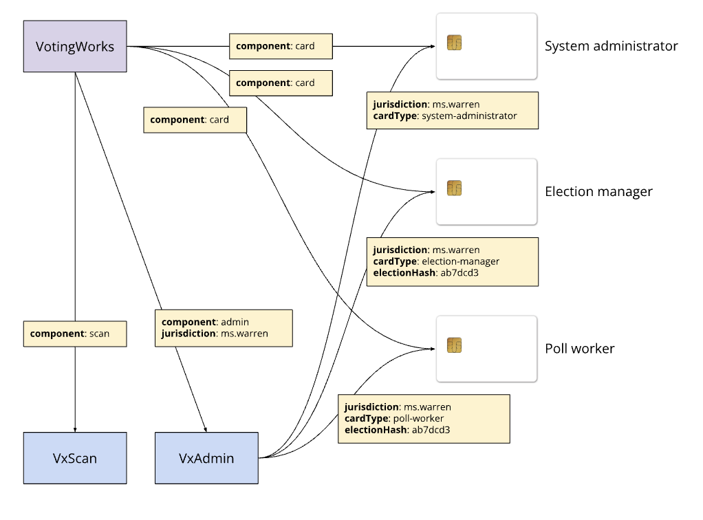

# Reliably Detectable Marks

Marks are determined valid and counted by the system if the amount of darker pixels in the bubble area exceeds a configurable "definite" mark threshold set in the [election-package](../system-overview/election-package/ "mention") System Settings file. This mark threshold can be adjusted to have a stricter or looser interpretation of what is considered a valid mark.&#x20;

The recommended and default threshold is 7%. With this threshold setting, hand marked paper ballot interpretation detects a valid mark per the mark conditions described by VVSG 1.1.6-H.

At this default threshold, marks such as a light dot, a fold through a bubble, a stray mark outside of the bubble, or a small line just on the corner of a bubble will be considered invalid. Marks such as a completely filled bubble, half filled bubble, or an X in a bubble will be considered valid.

Examples of invalid and valid marks along with the score for that mark (in green) are shown below.&#x20;

The mark threshold set on a scanner can be checked by an election official at any point by viewing the readiness report for that device as described in [diagnostics.md](../system-overview/diagnostics.md "mention").

### Invalid Marks

<figure><figcaption></figcaption></figure>

### Valid Marks

<figure><figcaption></figcaption></figure>

