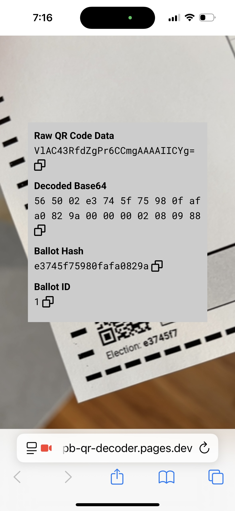

# VxScan Unique Identifiers

VxScan supports generating a unique audit identifier for each cast paper ballot. During a post-election audit, auditors can use these audit IDs to match a ballot to its corresponding cast vote record.

## Overall Process

1. A serial number is added to each hand-marked paper ballot. This serial number is encoded in the ballot's metadata QR code.
2. VxScan generates a random secret key when configured with an election package.
3. When a ballot is cast, VxScan generates a unique audit ID for the ballot by randomizing the ballot's serial number using AES-256. It adds the randomized audit ID to the CVR.
4. After polls are closed, an election manager saves the secret key from VxScan.
5. During a post-election audit, an election official with access to the VxScan secret key derandomizes the audit IDs in the CVRs using any tool that implements VotingWorks's publicly specified derandomization logic, as documented in [this open-source script](https://github.com/votingworks/vxsuite/blob/v4.0.2/libs/auth/scripts/src/decrypt_cvr_ballot_audit_ids.ts). For convenience, VotingWorks has deployed a proof-of-concept tool for this step in VxDesign.
6. Auditors compare the derandomized audit IDs to the serial numbers encoded in the ballot QR codes, pairing CVRs with their corresponding physical ballots for a ballot-comparison audit.

## Ballot Serial Numbers

At the point of election definition and ballot design, the QR code on each paper ballot is encoded with an optional `Ballot ID` value as defined in [#ballot-config-encoding](../../public-documents/ballot-qr-code-data-format.md#ballot-config-encoding "mention").

If using VxDesign as the source ballot creation system, one can automatically generate unique ballot PDFs with sequential serial numbers encoded in each QR code. Before exporting an election package and ballots, check the box labeled "Generate audit IDs for ballots" and enter the number of audit IDs or serial numbers to generate.

## Randomized Unique IDs

When configured with an election definition, VxScan generates a random secret key that it uses to randomize the ballot serial numbers as unique identifiers in the cast vote record. When ballots are cast and cast vote records are created, VxScan randomizes the ballot's serial number using AES-256 and adds this randomized unique ID to the `BallotAuditID` field in the CVR. See [cast-vote-records.md](../../system-overview/cast-vote-records.md "mention") for the complete CVR file format.

## Saving VxScan Secret Key

An election manager can save the VxScan secret key to a USB drive through the following steps:

1. Authenticate using an election manager smart card
2. Navigate to the `CVRs and Logs` screen in the election manager menu
3. Select `Save Ballot Audit ID Secret Key`

## Derandomizing Audit IDs in CVRs

The unique IDs generated by VxScan can be derandomized using standard AES-256 decryption with the secret key and CVRs generated from the same VxScan. This procedure can be incorporated into any tool that implements VotingWorks's publicly specified derandomization logic, as documented in [this open-source script](https://github.com/votingworks/vxsuite/blob/v4.0.2/libs/auth/scripts/src/decrypt_cvr_ballot_audit_ids.ts).

For convenience, VotingWorks has deployed a proof-of-concept tool for this step in VxDesign. Under the "Export" tab for any election is a "Decrypt CVR Ballot Audit IDs" section. Copy and paste the value of the secret key from the "ballot-audit-id-secret-key.txt" file on the USB drive that you saved the secret key to. Then locate the relevant CVR directory on your VxScan USB drive. From the root of the USB drive, navigate into `<election-specific-folder>/cast-vote-records/`. Pick out the relevant directory, e.g., `machine_0000__2025-07-25_11-44-45`, and zip it. In VxDesign, click "Select CVR Export Zip File" and upload the ZIP file that you just prepared. VxDesign will output a new ZIP file titled "decrypted-cvrs.zip" containing a copy of each CVR file with the derandomized ID, i.e., the ballot serial number, as the file name. For example, the CVR for ballot serial number `1` will be saved in the file `1.json`.

## Comparing Derandomized IDs to Physical Ballots

Auditors can use the the public [ballot-qr-code-data-format.md](../../public-documents/ballot-qr-code-data-format.md "mention") to identify the original serial number encoded on a given paper ballot and map that to the CVR for that ballot based on file name. The ballot selections on the physical ballot can then be compared to the selections recorded in the CVR.

For convenience, VotingWorks has implemented a QR code scanning website meant to be accessed on a smartphone: [https://vx-hmpb-qr-decoder.pages.dev](https://vx-hmpb-qr-decoder.pages.dev/). When pointed at a valid VotingWorks paper ballot QR code, the website will display the parsed contents of that QR code, including the ballot serial number. The website refers to the ballot serial number, if present, as the "Ballot ID" as you can see in the screenshot below.

<figure><figcaption></figcaption></figure>
